While I normally write about tech, this was a unique experience I want to share.

Early this year, I took a trip to the #1 place on my bucket list, Antarctica!
After listening to [this](https://www.bradyharanblog.com/antarctica-intro)
podcast many years ago, I always wanted to go. While doing a cruise on an
expedition ship would have been too expensive, my parents and I were able to make
it work more affordably by taking a cruise on a
larger ship. We found a cruise that worked in our budget on the Celebrity Eclipse,
though unfortunately we would not be stepping foot on the frozen continent.

On January 3rd, I flew from Cedar Rapids to
Dallas and then Dallas to Buenos Aires, Argentina.
In Buenos Aires, I met a driver I had pre-arranged who took me to my hotel downtown.
After nearly 24 hours of travel and arriving early in the morning,
I was wiped so I was able to crash and catch up on sleep, though
I did walk around a little bit.

The next day, my parents arrived in Buenos Aires on the cruise ship from the previous
leg (they had gotten on a few weeks prior). We had a walking tour booked
with a local guide who met us at the hotel. We took a train north towards
the Tigre Delta and then had a private boat ride through the area, which had a
similar feel as Florida. It was surprising to see an area so relatively remote
just outside a massive metropolitan area. Afterward, we walked around a local
market and took a different train back towards the city center.
It was a very nice tour.

The next day was my turn to board the cruise ship.
Since my boarding time was later in the afternoon, my parents and I walked around
a local high-end shopping mall. Unfortunately, boarding the ship was a bit difficult.
About a week before I arrived, there was a tornado in Buenos Aires and the
passenger ship terminal was still undergoing repairs so most of the operation
was running out of the freight terminal. All and all, it took me two and a half
hours to board the ship. We did have a nice dinner at one of the onboard
specialty restaurants that evening.

With three sea days before our first port of call, we had scheduled a
backstage tour on the ship. I will say, with all the waivers we had to sign and
mentions of required PPE, I was slightly disappointed. It made it sound like we
would get to see the engine room or other exciting areas. In reality, we saw the
ship's main galley, storerooms, engine control room, laundry facilities,
and the bridge. It was still interesting though, especially the engine control
room with an officer who gave a great in-depth lesson in the ship's propulsion and
electrical systems.

Our first destination was Ushuaia, Argentina, known as El Ciudad Del Fin Del Mundo
("The City at the End of the World"). In Ushuaia, we had a private tour with a local
guide in his minivan. We drove around some of the neighborhoods in town and then
headed north into true Patagonia. The mountain scenery was just phenomenal.

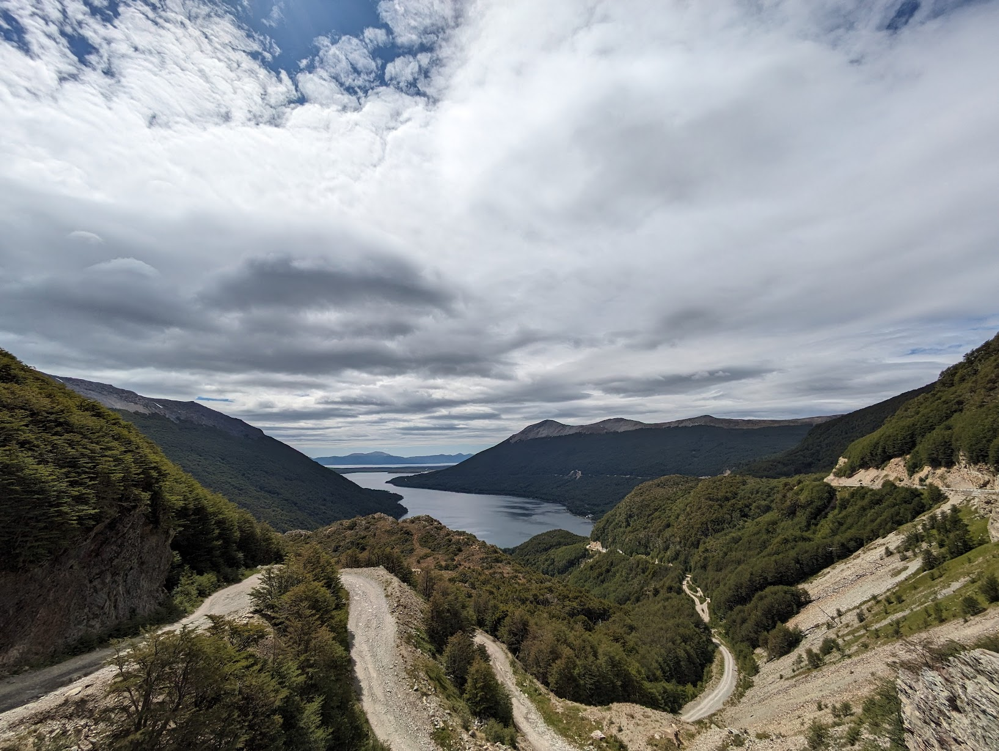

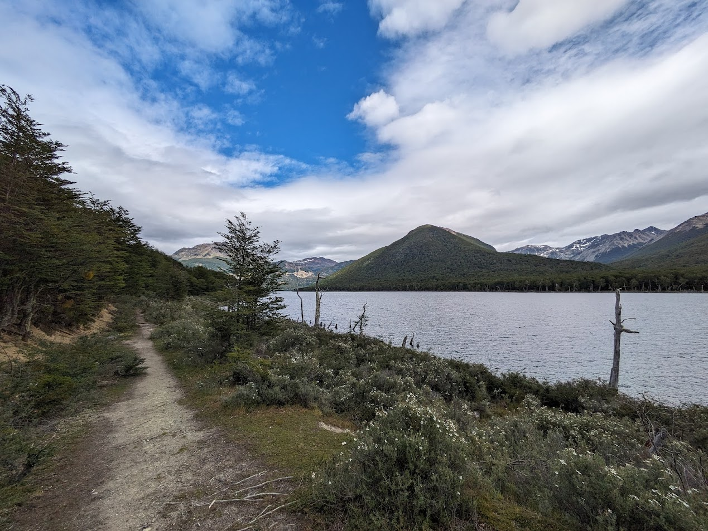

Towards the end of our drive, we stopped at a local Coast Guard base and walked around
the beach.

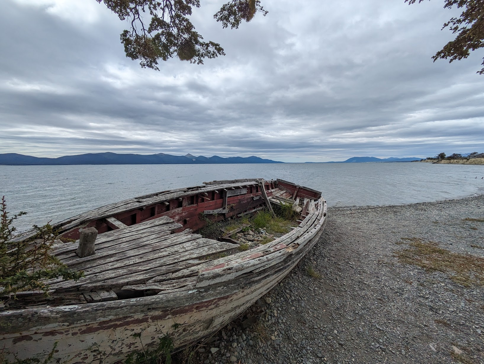

Heading back into town, we stopped at an overlook of the city by a hotel.

Finally, we made a quick stop at the airport and caught a few general aviation planes
taking off and landing.

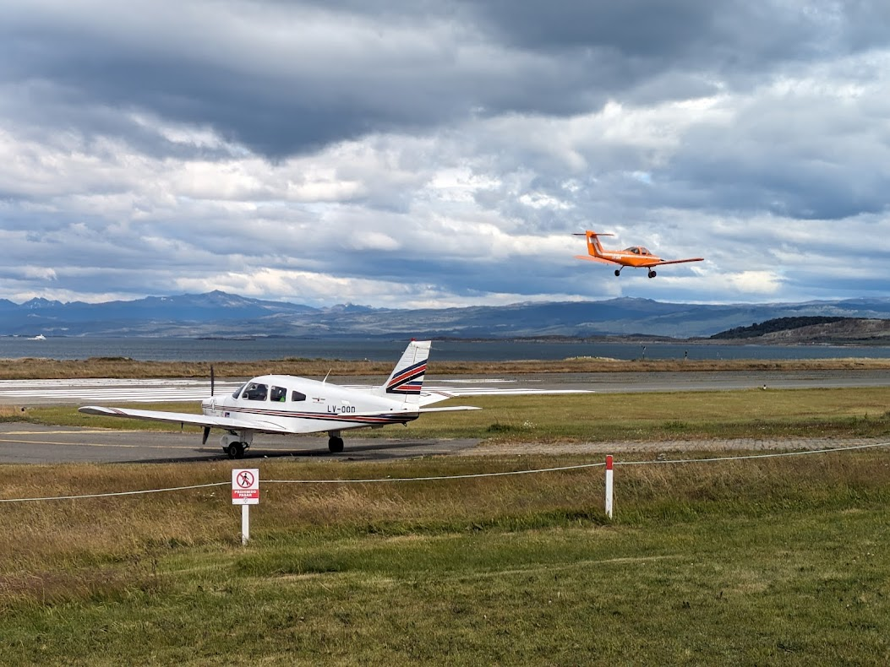

The scenery in Ushuaia was incredible and it's just hard to describe.
Our guide dropped us off at the prison museum that we wanted to go through.
Ushuaia was founded as a penal colony (because if the prisoners escaped,
where were they going to go?) and the old prison is now preserved as a museum.

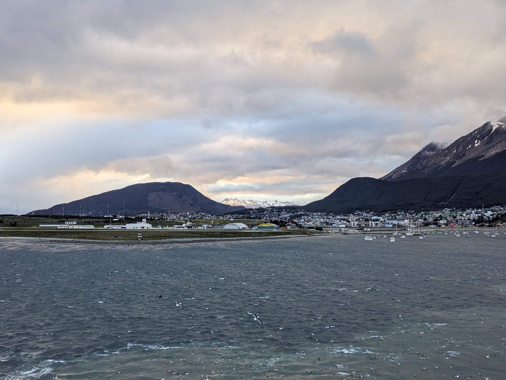

Now see, the day before we got to Ushuaia, I woke up feeling a bit sick, but my
parents had brought some cold and flu medicine and I was able to power through the
next two days. I had a really sore throat that made it painful to talk and a lot
of congestion. However, the day after Ushuaia, our medicine ran out (and we were
unsuccessful in buying more with our limited Spanish) and I couldn't stand it anymore.
I went down to the ship's doctor to get checked out and see if I could get
prescribed something. Since I was exhibiting COVID-like systems, I was tested,
_aaaaand_ I tested positive. This was my first time catching COVID and I had just
scored a one-way ticket to quarantine in our cabin for five days.

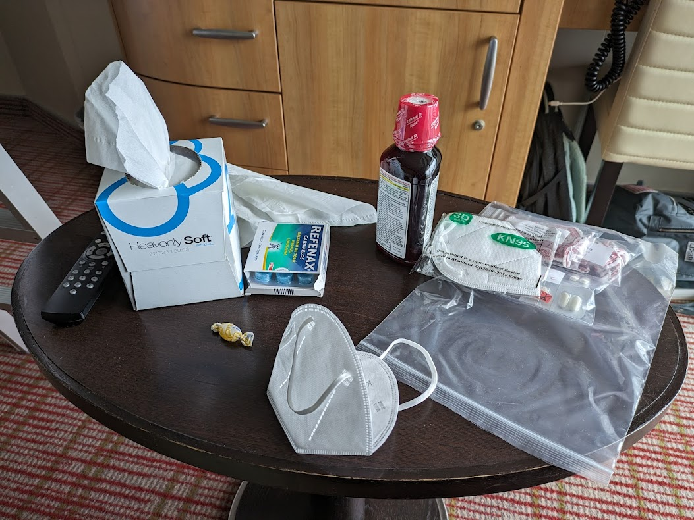

All and all, the days blended together and I felt it went by pretty fast.
I had bought a Nintendo Switch for this trip given the number of sea days and that
ended up being used more than I was planning. I was able to order room service from
the main dining room and I was given access to the premium onboard internet access.
Besides not being able to leave my room, the biggest annoyance was the number of
phone calls. I had to answer the phone six times per day to make sure I was still
in the room, see how I was feeling, and place room service orders. This made taking
naps and getting some rest rather challenging. Other than that, while it wasn't fun,
it wasn't awful.

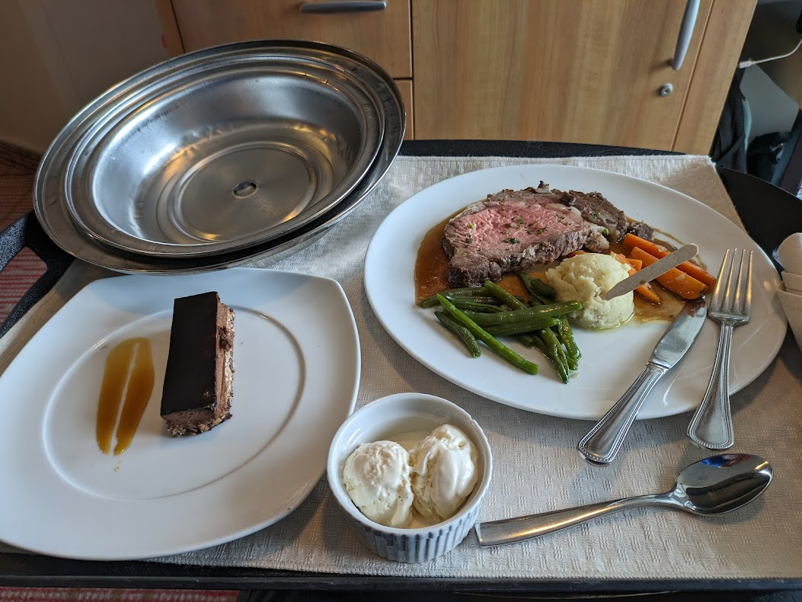

Thankfully four out of my five days of quarantine were sea days as we transited the
Drake Passage and sailed through the Antarctic Peninsula.
As we got into the Antarctic Peninsula, we sailed through the Schollart Channel and
to Paradise Bay.

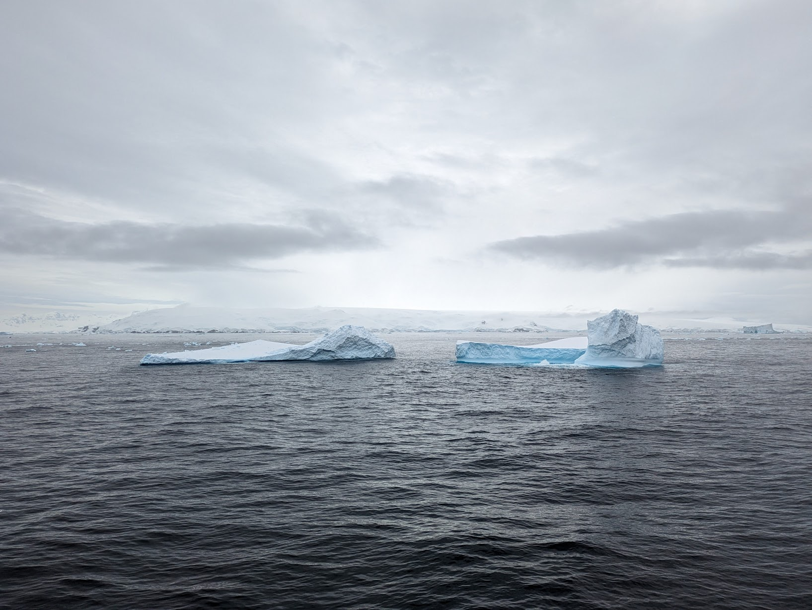

There weren't many visible penguins on the first day. They're so small that unless
they are very close to the ship, they're impossible to spot. The colonies are visible
as penguin poop is pink from the krill they eat, so those are easy to spot.

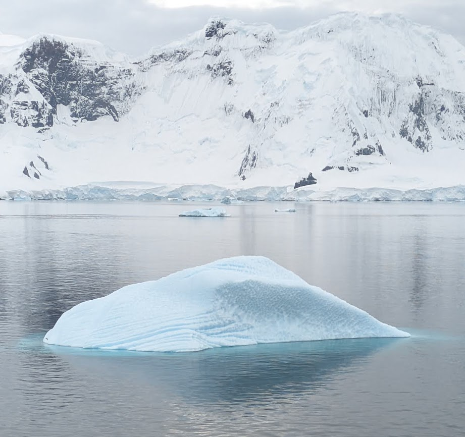

While we were in Paradise Bay, one of the onboard naturalists was narrating.
He flat out said don't bother coming back, you'll be disappointed.
The weather was absolutely perfect. Calm seas, great visibility, and it never got
below freezing.

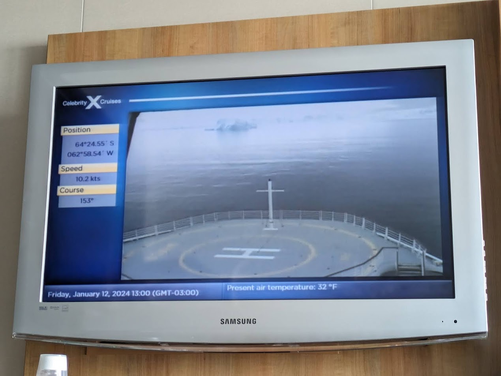

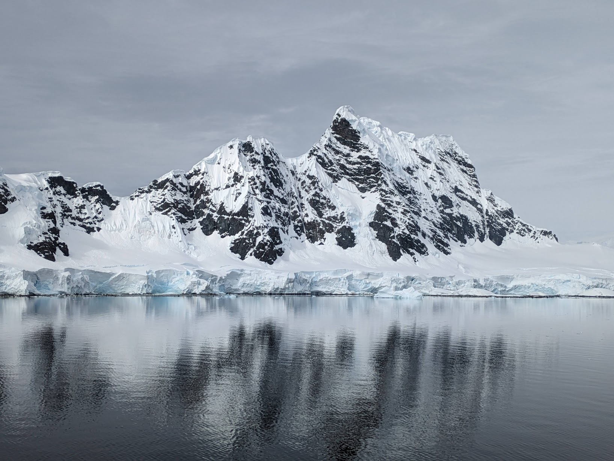

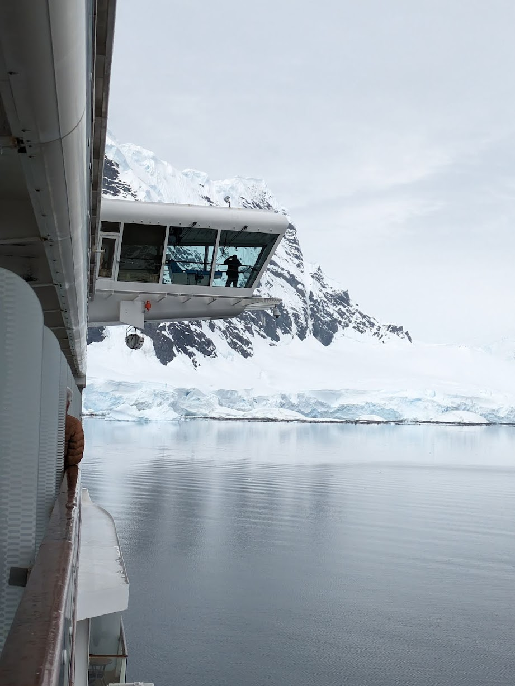

It was incredibly serene down in Antarctica. The snow absorbs a lot of sound, and
other than our ship quietly cutting through the water and a few other ships
in the vicinity, there is no evidence of humans. It's very humbling.

The scale of the Antarctic mountains really surprised me, it was not something
I was expecting. The following day, we sailed around Elephant Island where
Shackleton and his crew were stranded for a while. Again, another beautiful day.
Here, the penguins were very active, as the bow thrusters of the ship were stirring
up a lot of plankton so they were swimming around catching food.

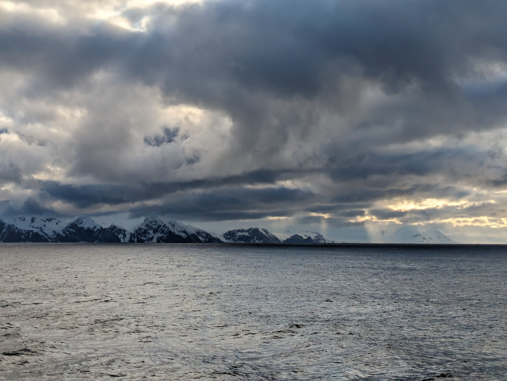

After our amazing two days in Antarctica, we sailed towards the Falklands.
On my fifth day of quarantine, we made our stop at Port Stanley. Unfortunately,
due to the very high winds and lack of a large enough pier, the day was canceled as
tender operations could not be done safely. Everyone was disappointed, though I was
secretly happy as I didn't end up missing anything. Because of this, we ended up
having six consecutive sea days.



Our next stop was Puerto Madyrn, Argentina. I was very excited to finally step
off the boat and see something more than the inside of our cabin. My dad and I were
scheduled to snorkel/swim with the sea lions in Puerto Madyrn. As we walked down the
pier, I noticed a big mass of white stuff in the water. I quickly realized they were
jellyfish.

I was suddenly less excited about swimming. As it turns out, the waves were too
rough and the wind was blowing in the wrong direction, so no swimming.
Because of that, the local tour operator we booked it through offered to do his
other city tour for $40. With nothing else to do, we said sure. We went to his
office to pay and he said he'd come and pick us up. Turns out his minibus of
other people who booked ahead of time was full, so he was going to take us in
his personal pickup truck instead. It still ended up being a good day.
The landscape is extremely barren and reminiscent of West Texas, yet the ocean
is so full of life. We were able to go to the local national park and still
see the sea lions just from the cliffs above.

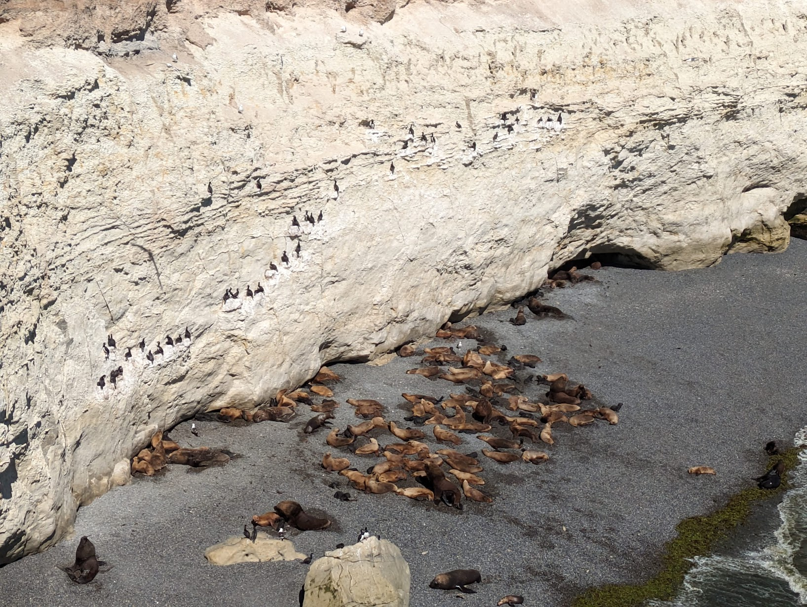

On the way back into town, some local horses had formed a roadblock and were
checking cars for food.

On the pier walking back to the ship, we ended up having one of the best views
of the sea lions. About a half dozen were napping on the steps into the water.

The next day, our last port of call was Montevideo, Uruguay.

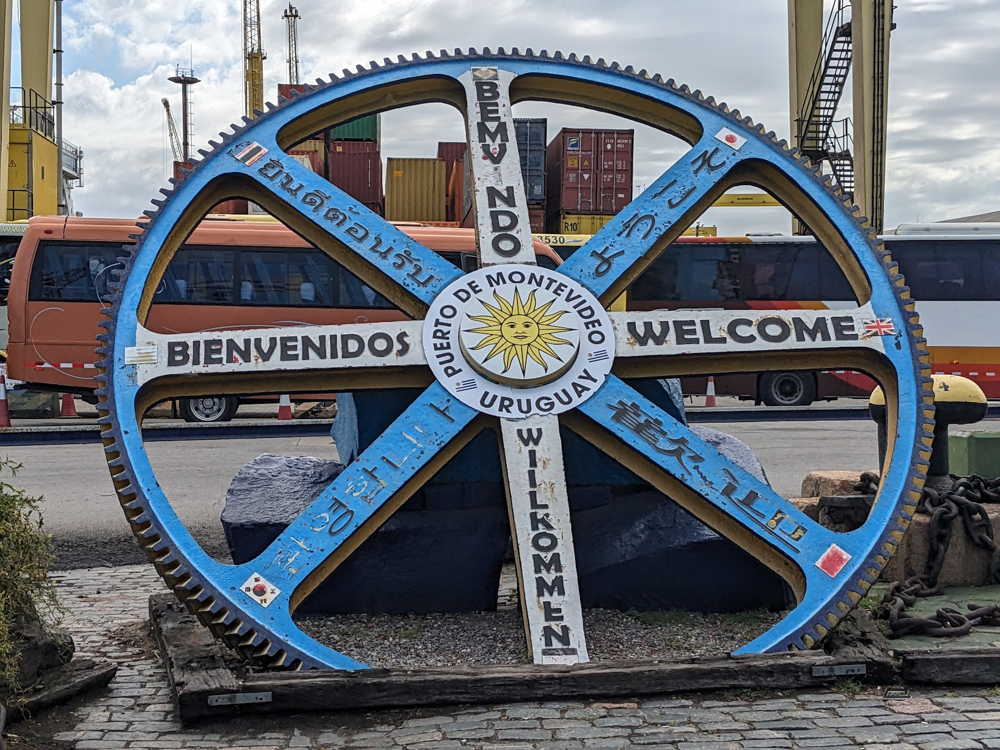

In Montevideo, we did a city tour that drove us around and saw
the sights. Besides driving around
the city, we stopped at a local market and the country's capitol building.

Afterward, we walked around on our own back towards the port. The day after we
were there, the city of Montevideo was celebrating its 300th birthday, so there
was lots of live music and events being set up.

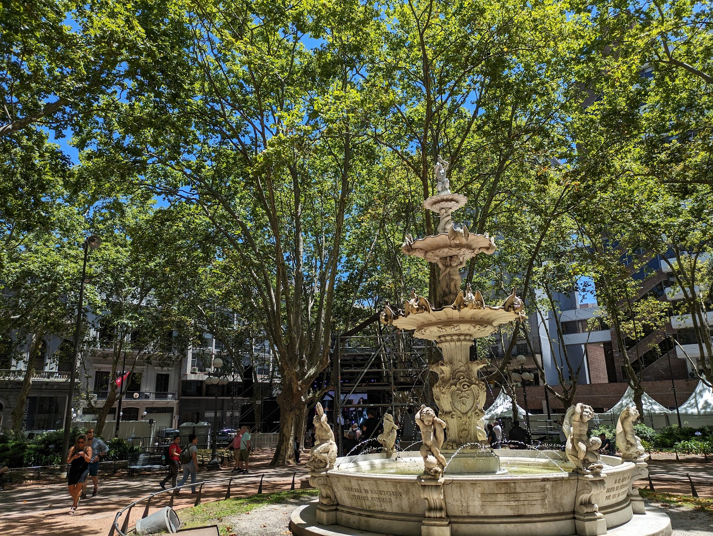

Lastly, before getting back on the ship, we walked through an indoor shopping mall
and meat market that smelled heavenly. There was haze in the whole building of the
smoke from the grills and the smell permeated the entire place.

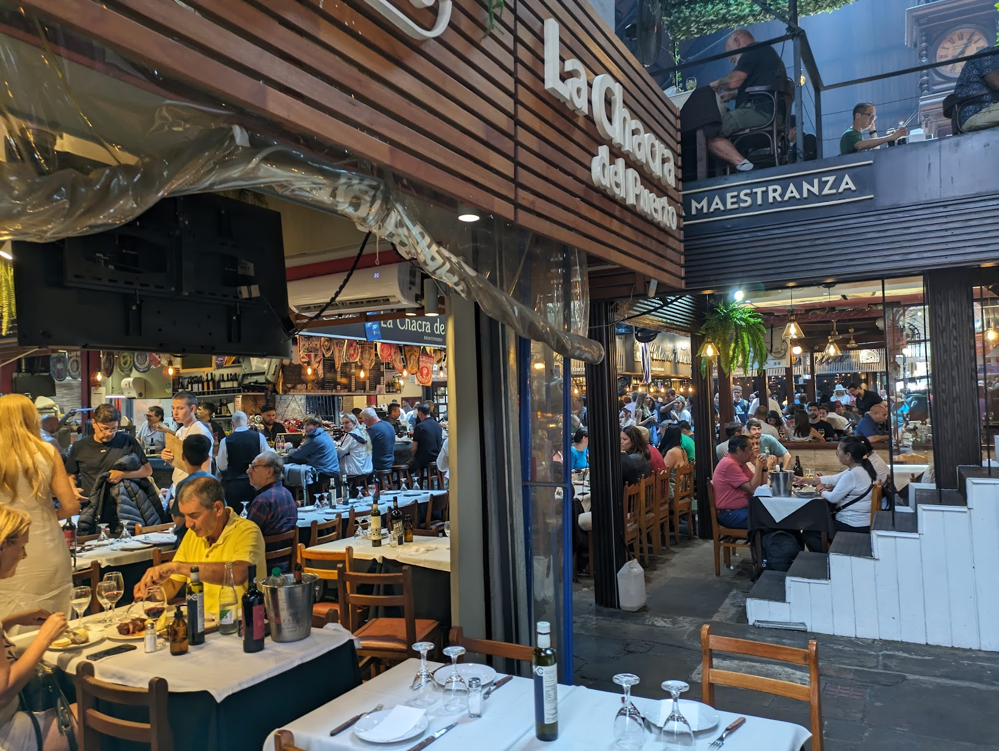

I knew very little about Uruguay before hand, so it was interesting to learn
it's one of the safest and most prosperous countries in South America.

The next and final day was departing the ship in Buenos Aires. As our flights were
not until nearly midnight, we had booked a shore excursion through Celebrity to take
us to a [Gaucho](https://en.wikipedia.org/wiki/Gaucho)
(a South American cowboy-esque subculture) ranch to spend the day and
drop us off at the airport at the end. Unfortunately one of our bags did not show up
and we had to board the tour bus, so we abandoned it and filled out a lost bag form.
The tour first took us through an above-ground cemetery for wealthy people in
Buenos Aires.

Afterward, we were taken to the ranch, where there were traditional dances,
lots of food, peacocks that were very accustomed to people, and finally a
Gaucho demonstration on horseback.

Thankfully while at the ranch, our bag was found and sent to the airport
to meet us there with our other bags.

Finally, I started my trip back home, with flights from Buenos Aires to Miami,
Miami to Chicago, and Chicago to Cedar Rapids. Unfortunately, my final leg
to Cedar Rapids ended up being delayed **seven** times, and once
I got to Cedar Rapids, my car was buried in the parking lot. I had to un-bury
it in the below-freezing cold by myself to get home.

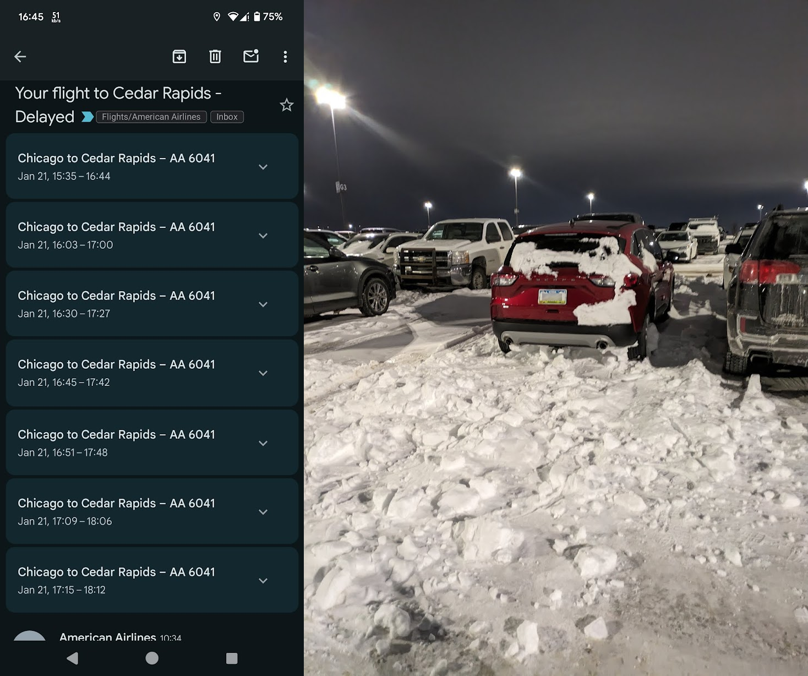

Despite all of the things that went wrong, it was the trip of a lifetime, and my
parents are already planning on going back. The pictures truly do not do the beauty
of Antarctica justice.
