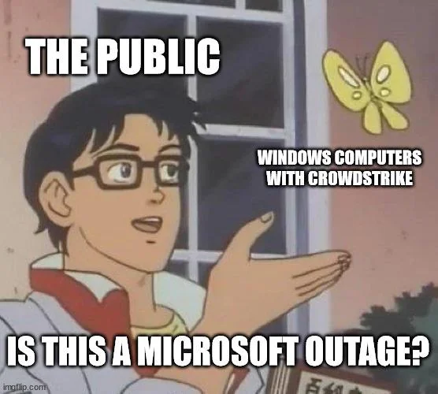

There's been a lot of bad reporting on the global IT system outages today, so I want
to publish some correct information.

## What Happened

Around 3am Central Standard Time on July 19th, 2024,
[CrowdStrike](https://www.crowdstrike.com/) pushed a new
content update for their endpoint protection software, Falcon. These sorts of updates
are meant to improve malware detection, happen very frequently, and are supposed
to be minimally disruptive. Because of this, my current understanding is that
CrowdStrike does not allow administrators to defer these updates, nor do any sort
of canary deployments.

However, some part of this update clearly had issues. Most (if not all) Windows systems
running CrowdStrike Falcon and downloaded the update
immediately blue screened and got stuck in an infinite boot loop.

To fix the issue, a
[single file](https://www.crowdstrike.com/blog/statement-on-falcon-content-update-for-windows-hosts/)
has to be deleted on the affected computer. However, this is challenging to automate
as Windows is stuck bootlooping. Most systems will need to be manually fixed with a
recovery operating system attached to the disk. Many organizations use BitLocker
which complicates this further as the recovery key will be needed to access the disk.

For servers with out-of-band management systems or virtual servers, the cleanup will
be easier, but for systems without that functionality such as user workstations,
each one will likely need to physically worked on. Either way, most if not all systems
will need to be manually fixed.

## What Was Affected

Just about any network-connected Windows system running CrowdStrike Falcon when the
content update was pushed out was Order 66'ed. While no numbers have been released yet,
the number of affected computers is likely in the millions.

2024-07-20 update:
Microsoft currently estimates
[8.5 million devices](https://blogs.microsoft.com/blog/2024/07/20/helping-our-customers-through-the-crowdstrike-outage/)
were affected



This included Windows servers (physical and virtual) and workstations. Many hospitals,
emergency services, airlines, and other enterprises (including my employer)
were affected.
[Delta](https://news.delta.com/update/july-19-2024-operation/delta-extends-waiver-support-vendor-it-issues-recovery-continues),
[United](https://x.com/united/status/1814360333068411053), and
[American Airlines](https://news.aa.com/news/news-details/2024/Global-technology-outage-OPS-DIS-07/default.aspx)
all issued full ground stops for their fleets. The London Stock Exchange was also
reportedly affected.

## What Didn't Happen

No one was "hacked" (despite what some people in my office thought this morning).
At the time of writing, CrowdStrike hasn't exactly said what went wrong in their
testing process, but they seem to have
[taken responsibility](https://www.crowdstrike.com/blog/our-statement-on-todays-outage/)
for the screw up.

2024-07-20 update: CrowdStrike has posted [more information](https://www.crowdstrike.com/blog/falcon-update-for-windows-hosts-technical-details/)
on what went wrong, though it is far from complete.

Microsoft is not involved in this, despite much media coverage to the contrary.
While Microsoft had a major outage in the Central US Azure data center the previous
day (2024-07-18), this was unrelated and coincidental. The bad update only affected
Windows systems running CrowdStrike Falcon, not Linux or MacOS, which may be why
so many people focused on Microsoft.

## How Do We Prevent This

This is tough. Generally, quickly preventing security threats is considered a good
thing. No one wants to have their systems compromised because their antivirus software
took a week to protect against a new
[0-day](https://en.wikipedia.org/wiki/Zero-day_vulnerability). However, I think many
organizations are going to re-evaluate how they control software updates in every
part of their technology stack, and no longer just the big ticket items like
operating system or database versions.

To their credit, the most secure system in the world is one that isn't running,
so arguably CrowdStrike helped everyone improve their security posture today.

## References

Mainly discussions in the [/r/sysadmin](https://www.reddit.com/r/sysadmin/) subreddit
such as
[this](https://www.reddit.com/r/sysadmin/comments/1e6yjjf/we_may_be_witnessing_the_largest_it_outage_in/),
[this](https://www.reddit.com/r/sysadmin/comments/1e6vq04/many_windows_10_machines_blue_screening_stuck_at/),
and [this](https://www.reddit.com/r/sysadmin/comments/1e6vx6n/crowdstrike_bsod/).
