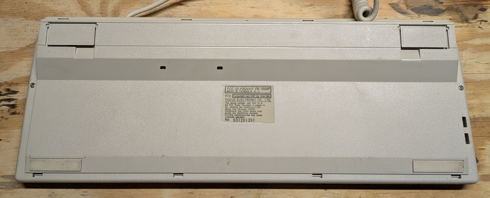

## Background

While randomly browsing eBay for "old keyboard", I stumbled across
a listing for a FK-7000P keyboard.

When I searched it at the time, Deskthority had
[very little information on it](https://web.archive.org/web/20240201173649/https://deskthority.net/wiki/Focus_FK-7000P).
With the keyboard being confirmed as mechanical, and extremely weird, I had to have it.
I love retro computer things and especially uncommon things.

## Box

A cool thing about this listing is that it came with the original box.

A couple interesting things to note about the box:

1. The box says "Windows, OS/2 Ready". OS/2 was publicly announced and released in 1987.
   The first version of Windows was released in 1985. We'll come back to this.
2. The box also uses the phrase "Super Spacesaver". Generally, the "Spacesaver" term is
   used for keyboards without a numpad, such as the
   "[IBM Space Saving Keyboard](https://deskthority.net/wiki/IBM_Space_Saving_Keyboard)".
   This keyboard clearly has a numpad, and I'm not really sure what space they're
   claiming to save.
3. This keyboard was manufactured by
   [Focus Electronic](https://deskthority.net/wiki/Focus_Electronic).
   However, there is no branding on the box with the "Focus" name,
   only their "Key Track" branding. The closest thing to a brand name anywhere
   is the "FK" prefix on the model number, or on the sticker on the bottom of the
   bottom of the keyboard.

## Keyboard

The keyboard itself is a full-size 103-key keyboard with a trackball where the
arrow keys would usually go. Instead, around the trackball are mouse button-like
arrow keys. Additionally, a left and right mouse button are located below the
right control key.

A couple layout oddities:

- The right <kbd>Shift</kbd> key is unusually narrow, and to the right of it is the
  <kbd>\\</kbd> key.
- While this keyboard has "Windows" keys, the left key is blank and the right key has
  an asterisks on it (more on this later).
- The lock lights are embedded in the relevant keys, instead of the normal location
  on the keyboard (again, more on this later!).

Now, let's talk about the most interesting part, the keys and keycaps.
The key switches are knockoff Alps switches of some kind. They're white, clicky,
and totally unbranded other than some four digit code that is different on almost all of
the switches.



The three switches for the lock keys are notable exceptions. These three keys
have a red LED embedded in the switch, are yellow, and are linear switches with no
click. The keycaps themselves have little windows embedded in them.

The keycaps are all double shot and appear to be ABS.

The <kbd>Print Screen</kbd> key and <kbd>Pause</kbd> key are the only two keycaps
that also have side legends. These are printed on and are not part of the plastic.

Across all of the keycaps, there are four different colors. Most keycaps have black
text, but the <kbd>Ctrl</kbd> keys have red text, the <kbd>Shift</kbd> keys have green,
and the <kbd>Alt</kbd> keys have blue.

## Disassembly

To take apart the keyboard, I first removed as many keycaps as feasible. Clearly the
keycaps have never been removed before, as they took a huge amount of force to pull off
with my keycap puller. A couple I left on because I was bending the backplate so much.

The <kbd>Shift</kbd> keys, <kbd>Enter</kbd> keys, Numpad <kbd>+</kbd> key,
<kbd>Backspace</kbd> key, and spacebar all have stabilizers. These all popped out
without damage as I removed the keycaps, but I would still be careful with them.

To take the top case off, remove three screws on the bottom. Next, you will need
to undo eight clips: four on the top edge and four on the bottom edge.

I found my [iFixit Opening Tools](https://www.ifixit.com/products/ifixit-opening-tool)
to be really good at helping get the clips undone without chewing into them.
Once you get the first one, the rest are easier.

Carefully remove the top case and try not to send the trackball flying. The
top case is the only thing holding it in place. I may have dropped the trackball
more than once while disassembling and cleaning this keyboard.

To remove the main PCB from the bottom case, remove four screws. There are two
on the edges of the trackball assembly, one holding the grounding strap next
to the connectors, and one holding the backplate to the PCB next to the trackball.
With these removed, the circuit board can lift out.

Be sure to carefully lift out the mouse button daughter board. It is only connected by
three small wires.

## Observations

After removing the PCB from the bottom case, I noticed a couple things.

First off, despite the lack of branding on the outside, I counted four different
Focus logos on the inside.

The QA sticker in the above collage features a date: December 15th, 1982.
This is... peculiar. Remember how the box said "Windows, OS/2 Ready" and
that implies this was made around 1987? This sticker implies this keyboard is
from 1982 and predates OS/2 by five years.

Adding to the mystery, based on
[this Wikipedia image](https://en.wikipedia.org/wiki/Intel_MCS-48#/media/File:Intel_8049_Microcontroller.jpg),
the main microcontroller has a date code representing manufacture in late 1989.

All-in-all, I'm not sure what to make of this. The serial number starts with "93" so
maybe that's a clue. The PS/2 port was introduced in 1987, so I wouldn't think
this keyboard could be too far past that. Overall, it's hard to tell the vintage of
this keyboard.

Next, despite the lock lights being integrated into the key switches and keycaps,
the plastic mold for the top case still has the cutouts for them. The "Key Track"
sticker is just slapped over top.

Remember that blank left "Windows" key? The PCB helpfully labels every single key
in the design. That key is labelled "MACRO".

On my Windows 11 computer, this registers as
[`IntlBackslash`](https://www.w3.org/TR/uievents-code/#code-IntlBackslash)
which is somehow different from a normal backslash.

Making this even more weird, on my Ubuntu 24.04 laptop, this key registered
as a standard <kbd>\<</kbd> key.

Another thing I want to point out is how flimsy the arrow key buttons are.
There is very little material holding them on and they're designed to flex.
I don't foresee them surviving a lot of use.

Lastly, the trackball mechanism is pretty old. There are two rotary shafts, one
below the trackball and one to the right side. Each is spring-loaded and pushes
into the trackball with a little rubber wheel. The rotation of the shaft is determined
by an optical encoder. On each shaft is a wheel with lots of slots in it.
On one side of the wheel are two lights (photodiodes) and on the other side are two
sensors (phototransistors). As the wheel rotates, the light is either blocked or
visible, and the sensors are positioned such that while one is blocked the other
is visible. This allows it to determine the direction of rotation.

In practice, it's not great. If the rubber on the shafts get dirty, they can slip
and not register movement. Additionally, since the rubber is spring-loaded, it doesn't
work as well in the opposite direction. After cleaning and putting everything back
together, I found the trackball doesn't reliably register going left or up.
With the nature of the encoder wheel, there is a minimum
rotation required to register movement, too.

Here are a couple more photos for posterity:

## Cleaning

Finally, let's talk about cleaning. Really, this isn't anything special.
After taking all the keycaps off, I let them soak in a bath of warm soapy water.

For the keyboard itself, I spent a lot of time with cotton swabs and isopropyl alcohol.
It made a huge difference.

")

I cleaned the rubber contact rollers for the trackball with a cotton swab and isopropyl
as well. I put a little bit of dry graphite lubricant on the shafts to stop
them from squeaking, too.

## Repair

Before putting everything back together, I thought it would be good to ensure
that everything worked. I'm glad I did, because numpad <kbd>0</kbd>,
numpad <kbd>7</kbd>, and both <kbd>Enter</kbd> keys were not working.
It seemed like an odd combination of keys to not work so I was worried.

Undeterred, I poked and prodded at the PCB with my multimeter. After around 30 minutes,
I found the problem. Since this is a single-layer PCB, whenever two traces needed
to cross, they put a wire over the top. One of these under the backplate
had broken. The broken wire was the ground for this set of keys.

Since removing the backplate was going to required desoldering every single
switch, I decided to just add a bodge wire.

This worked and fixed everything!

## Reassembly

Reassembly was basically the opposite of disassembly. When putting the keycaps
with stabilizers back on, I found it easiest to put the stabilizer on the backplate
first (since this required a lot of force to press into place), then put the keycap
on the stabilizer, and then put the keycap on the switch.

Also, make sure to get the mouse button daughterboard back to how it was, I found it
easy to accidentally pinch the wires.

Lastly, when putting the top case back on, it took a surprising amount of force to
push the clips back together. None of them snapped for me though I was afraid
they would.

## Usage

For connectivity, the keyboard has a male 5-pin DIN connector, and a female DB9
(RS232) serial connector for the integrated mouse.

The keyboard helpfully came with the original user's guide as well.

Using the keyboard with a modern computer ended up being less painful than I expected.
Don't get me wrong, it was still painful, but less than I expected. Process:

1. Set the keyboard to "A" with the switch on the back.
2. Set the mouse to "2" with the other switch on the back.
3. Adapt the 5-pin DIN keyboard connector to PS/2. [Non-affiliate link](https://www.amazon.com/dp/B07KVDZWBX/)
4. Adapt the PS/2 keyboard connector to USB with an active adapter. [Non-affiliate link](https://www.amazon.com/dp/B00IACID2C)
5. Adapt the DB-9 mouse connector to USB. [Non-affiliate link](https://www.amazon.com/dp/B00AHYJWWG)
   I only ever tried adapters with the FTDI chipset and had no issues.
6. In Windows, use Device Manager to force update the drivers for the serial adapter.
   For me on Windows 11, it then triggered Windows Update to install the drivers.

Easy, right?

Overall, the experience is ... poor. I forced myself to write this section on the
keyboard itself to be sure. As mentioned early, the trackball barely
functions even after cleaning it. I can only describe the key switches themselves
as "crunchy". The action when pushing them is not smooth like modern mechanical
switches which have a nice smooth action. These feel like they're rubbing against
the wall of the switch on every press. This is especially pronounced on the modifier
keys like <kbd>Tab</kbd>. And because of this, sometimes you have to press
harder to get the switch to move since it feels like it's stuck, and then it goes all
at once.

Additionally, the keycaps have a little a
texture to them that I personally don't like. It's a stark contrast to the smooth
keycaps of the
[8BitDo Retro Keyboard](https://www.8bitdo.com/retro-mechanical-keyboard-c64/)
I've primarily been using lately. Lastly, since the switch for the spacebar is on the
right side and not centered or two switches, it's very uneven to press.



## Conclusion

Overall, this keyboard is odd to me. It was clearly not cheap when it was new.
It has mechanical key switches, double-shot keycaps, an intricate PCB, a metal
backplate and a well-designed box. However, the key switches are not great
and the trackball just sucks. It's a weird mix of high and low quality.

Hopefully you found this interesting, and this contributes some information to
an exceptionally uncommon mechanical keyboard.

