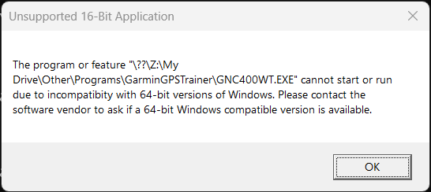
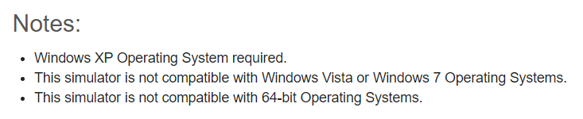
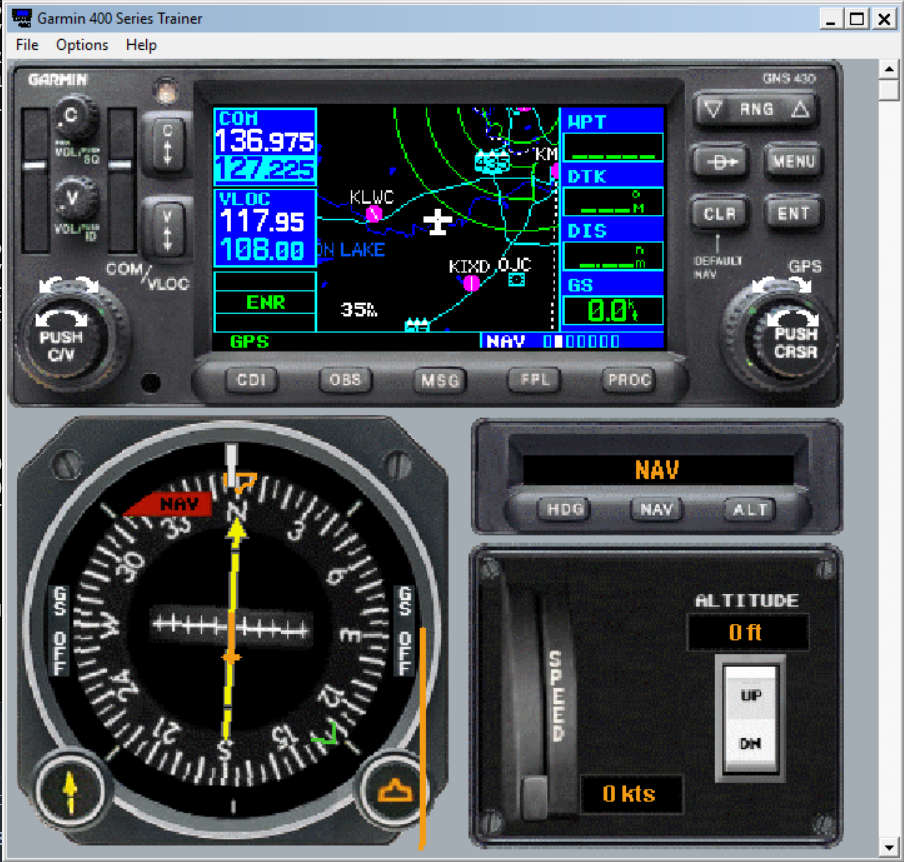
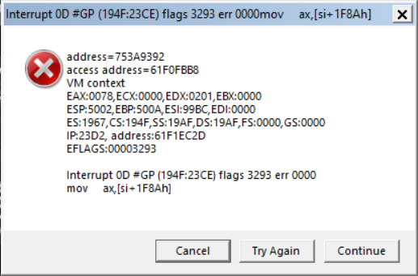

## Background

I've been working on getting my pilot's license and the plane I am renting has a Garmin
GNS 430 GPS in it. I wanted to practice using it outside the (expensive) airplane.
Garmin publishes a free simulator to use for Windows here:
[https://www8.garmin.com/support/download_details.jsp?id=3527](https://www8.garmin.com/support/download_details.jsp?id=3527)

However, this fails to execute on a modern version of Windows.

It even says on the webpage that it won't work.

## Solution

The fix is simple. Download and install [winevdm](https://github.com/otya128/winevdm).

Run the .exe again and it should work.

Well, most of it.

Clicking on anything in the HSI, nav mode selector, or altitude/speed selector
causes an interrupt. Still, it's enough for me to learn the menu layouts
and options before getting in the airplane and clicking "Continue" does
seem to let the program keep functioning.
