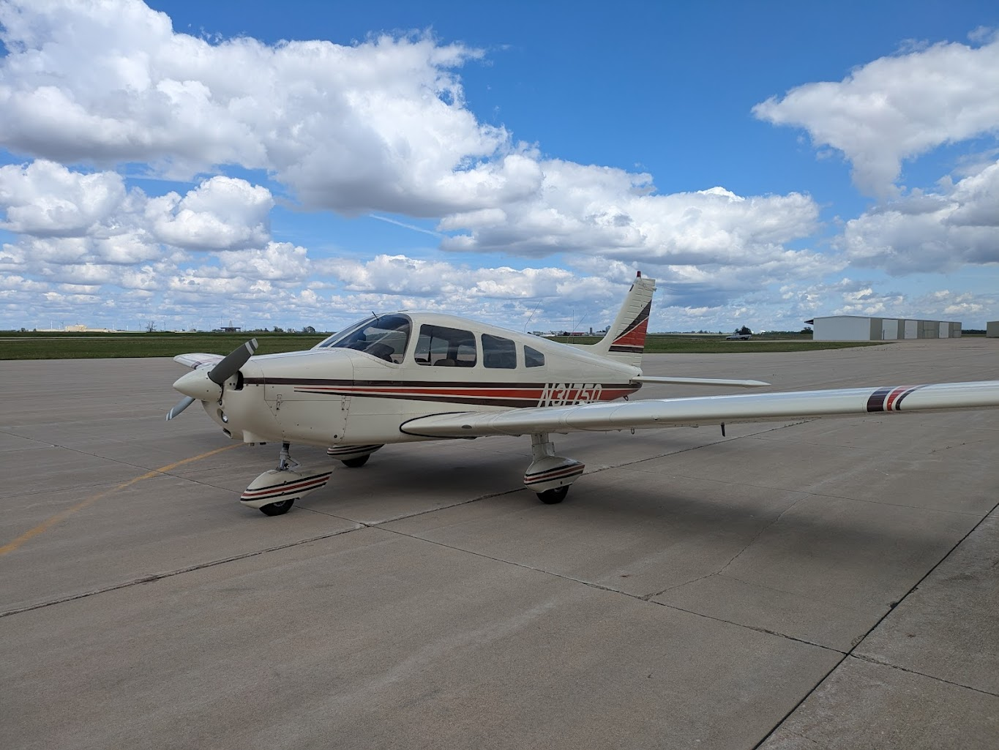
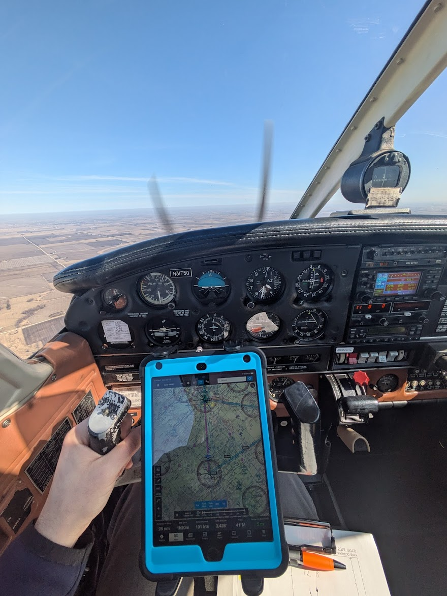
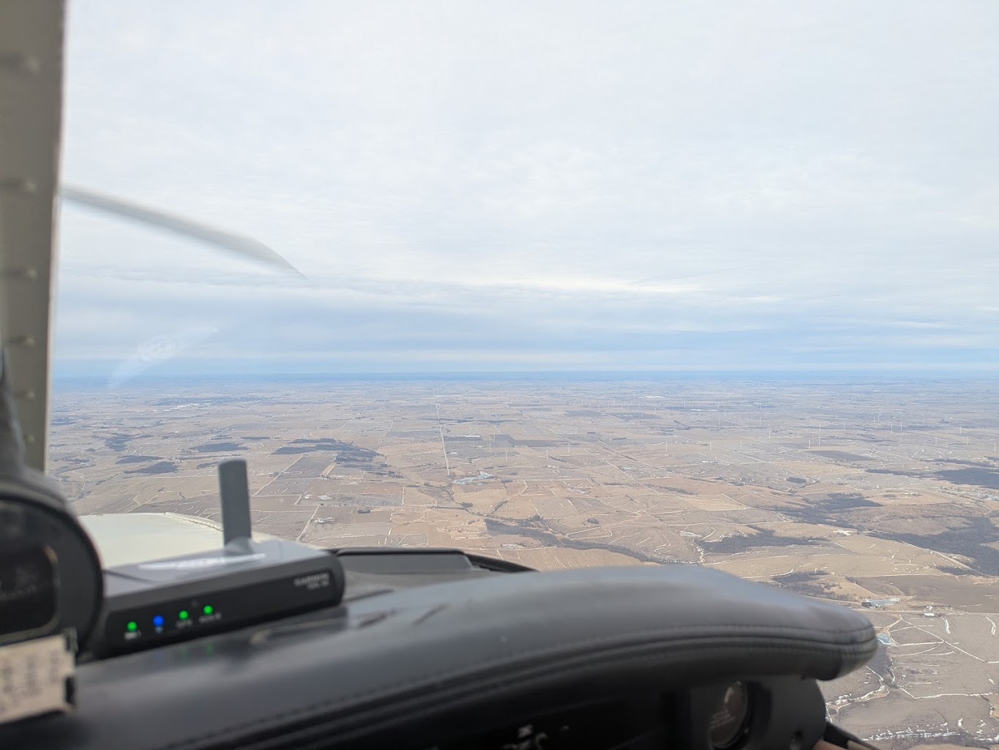
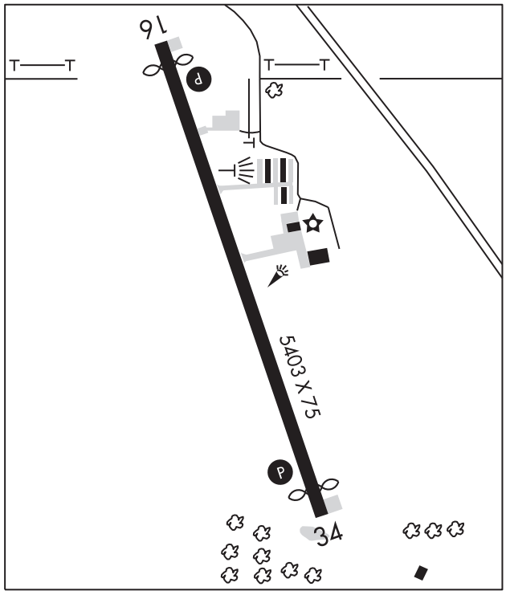
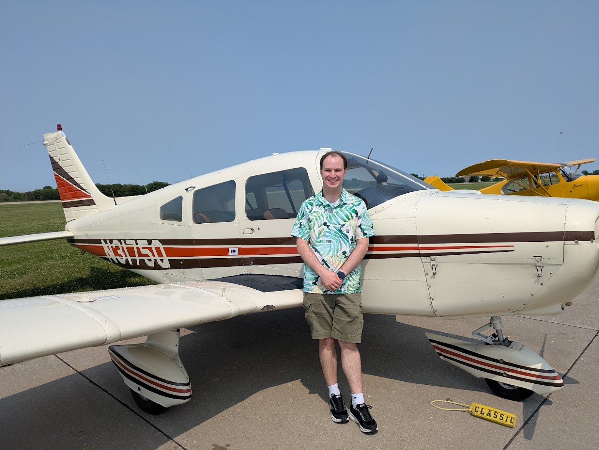
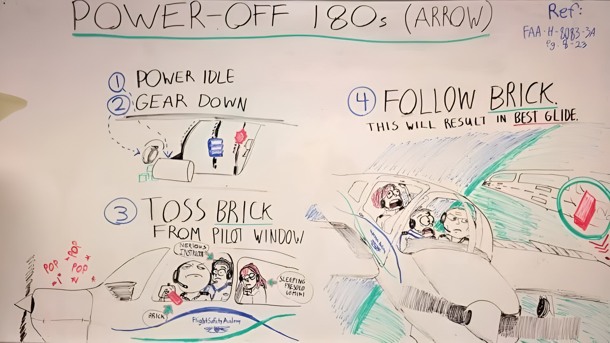

Earlier this year in 2025, I finally got my pilot's license!

Before I go into more detail, here's a breakdown of the major costs involved.
I had 62.1 hours of flight time when I took my checkride. I did all of my training
(other than a discovery flight) at Marshalltown Municipal Airport (KMIW).
Some small things (like batteries, sectionals, etc.) aren't included.

Total Cost: **$16,155.75**

Breakdown:

- Aircraft Rental And Instruction: **$12,083.20**
- Ground School Course: **$279.00**
- Ground Instruction: **$221.50**
- Test Fees: **$1,175.00**
- Class 3 Medical: **$160.00**
- Books: **$86.75**
- Headset: **$858.94**
- Flight Bag: **$79.95**
- iPad Mini 5: **$348.39**
- Garmin GDL50: **$514.94**
- SAFE Membership: **$45.00**
- ForeFlight Subscription: **$303.08**

## Costs

### Aircraft Rental

Obviously, this was the most expensive part. The airport I did my training at had
a weird pricing structure. While as a student, they charged $190/hour wet
(fuel included) for either of their Piper PA-28-161 Warrior IIs. With this rate,
the flight instructor was also included, which really made this not a bad price.
However, when flying the plane solo as a student, they also added a $1.25/hr
charge for insurance. This actually meant flying the plane solo was _more_ expensive
than flying it with an instructor, which seems bizarre.

I did ask if I needed to carry my own renter's insurance, but they assured me
this extra insurance charge was 100% comprehensive. I was never able to get this
in writing which made me nervous. They did eventually drop
this additional charge for insurance halfway during my training and rolled it into
the base cost.



The plane itself was _fine_. It's a beat trainer, and at least something was always
broken. But mechanically it seemed fine, and it had a Garmin GNS430 in it which was
handy. It did not have an autopilot or fire extinguisher.

### Ground School Course

Before starting to fly, I wanted to be as prepared as possible,
so I completed the
[Sporty's Learn to Fly](https://www.sportys.com/learn-to-fly-course-private-pilot-test-prep-online-app-and-tv.html)
course which I liked a lot. The videos are well produced with captions and quizzes,
their mobile apps work well, and the test prep was phenomenal.

My only complaint was I think some of the content was a little lackluster.
Probably the biggest sticking point I had was I felt the section on ATC communications
didn't do a good job of going over the "flow" of communications, but focuses more on
the technicalities of communication. My flight instructor had to teach me
about the flow between approach, tower, ground, clearance delivery, tower, and departure
for example.

Overall though, a solid 8/10 for getting me prepared.

### Ground Instruction

Since flight instruction was included in the aircraft cost, time with my flight
instructor in a classroom was around $25/hr. Thankfully my flight instructor
was pretty chill about billing in this department so it was not much cost.
I just needed a few sessions to talk about ATC, weather, getting ready
for my checkride, etc.

### Test Fees

Test fees were pretty brutal. I spent $175 to take my written test which I thankfully
passed the first time, and $1000 for my checkride. I was very fortunate
that my DPE accepted credit cards so I was able to get some rewards points from that.

### Class 3 Medical

Before I started flight instruction, I went and got my Class 3 medical certificate.
Unfortunately no doctors in Marshalltown will do this. I had to go to
[Story County Medical Center](http://www.storymedical.org/) for the exam.
My health insurance did not cover this.

### Books

While I generally live pretty digitally, I did buy a few books
during my training.

1. FAR/AIM 2025: While this is available digitally, coming to your checkride with
   a copy makes you look prepared. I recommend buying and applying tabs
   to the pages like
   [these](https://www.amazon.com/FAR-AIM-2025-Tear-Resistant-Color-Coded/dp/B0DBPM4VLD/).
2. Private Pilot Oral Exam Guide from ASA: In hindsight, this was kind of overkill
   but it was good to read through and get an idea of the kinds of questions that may
   be asked. In reality, the questions posed in the book were far more challenging
   that anything I actually got asked.
3. Everything Explained for the Professional Pilot: My coworker had a copy of this book
   he lent me and I really liked it. It explains a lot of stuff in plain English and
   is good reference material so I bought my own copy.

### Headset

This is getting into "optional" territory. Did I _need_ a new noise-cancelling headset?
No, I had my dad's old David Clarks that worked great. But damn are they so comfortable
and make long flights less fatiguing.

I ended up purchasing a pair of Lightspeed Zulu 3s at AirVenture for $800 as
well as
[Oregon Aero](https://www.oregonaero.com/headset-upgrades/headset-upgrades-overview)
ear cushions and ear seal covers. I really like the headset. It's so much quieter,
the braided cable doesn't get as tangled, and the Bluetooth to my iPad or phone
is nice for playing music as it automatically mutes if panel audio comes through.


My only complaint is that with the Zulu 3s the FlightLink audio recording
is not wireless, and requires another cable in the cockpit. I believe the Zulu 4s
now support this wirelessly.

One caveat is the Zulu 3s are not
[TSO](https://www.sportys.com/blog/tso-aviation-headsets-what-mean/)'ed,
so they are generally not allowed for airline use. Since I plan on flying
recreationally, this was not a concern for me.

### Flight Bag

Not too much to say, I was given the
[Sporty's Flight Gear iPad Bag](https://www.sportys.com/flight-gear-ipad-bag.html)
as a gift. It's really well laid out and I like it a lot. The only thing
it doesn't have room for is my iPad yoke mount, which I have to carry separately.
This is really the result of renting a plane that I can't keep stuff in.

### iPad Mini 5

I bought myself a used iPad Mini off of Woot to use in the cockpit. It's fantastic,
I use ForeFlight to get charts and airport information in-flight,
plus viewing documents I've uploaded. With my Garmin GDL50 (see below), the situational
awareness benefit is tremendous.

I did _not_ get a cellular model. This means the iPad does not have a GPS receiver.
I did this for three reasons. First, I was not intending on getting a SIM card for the
iPad. I didn't anticipate needing internet access in-flight, and if I do, I can setup
a hotspot off my phone. Second, I knew I was going to use a separate ADS-B In receiver
anyways which all include a GPS. Lastly, it was cheaper.

Personally, I like mounting it to the yoke, I found a window suction cup
mount to be kind of in the way. I use
[this mount from Arkon](https://arkon.com/collections/aviation/products/tab1rmcpm-clamp-tablet-locking-mount)
and take it with me every time I fly.



### Garmin GDL50

**_Giant_** caveat here, a close friend of mine works at Garmin so I was able to
get employee pricing on this.

This little box is an ADS-B In receiver as well as a GPS receiver and backup
AHRS device (provides attitude and altitude information). This is super handy in
the cockpit and just gives you so much more situational awareness. There's already
been multiple times flying where this helps me spot traffic I would have never
seen otherwise. With ForeFlight in particular, synthetic vision is extremely handy to
have, especially at night.

The major competitors are:

- [ForeFlight's own Sentry devices](https://flywithsentry.com/)
- [Stratus](https://stratusbyappareo.com/products/stratus-ads-b-receivers/)
- [Stratux](https://stratux.me/) (DIY device)

| Device       | Price                           | Connectivity | Protocol    | EFB Apps                               |
| ------------ | ------------------------------- | ------------ | ----------- | -------------------------------------- |
| Garmin GDL50 | $850 ($515 w/ employee pricing) | Bluetooth    | GDL39       | ForeFlight + Garmin Pilot + FltPlan Go |
| Sentry       | $599                            | WiFi         | Proprietary | ForeFlight + Jeppesen FliteDeck Pro    |
| Stratus 3    | $749                            | WiFi         | GDL90       | Basically All                          |
| Stratux      | $440-ish                        | WiFi         | GDL90       | Basically All                          |

I ended up choosing the Garmin box because of the employee pricing, connectivity, and
compatibility between different EFB apps. One of the nicest things about the
Garmin box is the Bluetooth connectivity. This is really handy with my
iPad since it kind of "just works", and I can still setup a WiFi hotspot
off my phone in-flight if I need. I also found it will happily connect to more than
one device, so both my instructor and I had our iPads connect automatically.

While the Sentry devices are attractive,
the fact they lock you in to ForeFlight really sucks. I didn't realize it when I bought
it, but the Garmin device _also_ uses a somewhat proprietary protocol. However,
both the major EFB apps, ForeFlight and Garmin Pilot support it. Garmin Pilot is
also available on Android, and can be easily decompiled, so there
is the possibility of
[reverse-engineering](https://web.archive.org/web/20221006165540/http://www.chartbundle.com/tech/gdl39/).

```java
// Some excerpts from the code with some hardcoded values

// sources/com/digcy/gdl39/Gdl39Connection.java
public class Gdl39Connection implements Closeable {
    private static final long ACCEPT_TIMEOUT_DURATION = 60000;
    private static final UUID DEV_UUID = UUID.fromString("00001101-0000-1000-8000-00805F9B34FB");
}

// sources/com/digcy/gdl39/Gdl39PresenceListener.java
public class Gdl39PresenceListener extends BroadcastReceiver implements Gdl39Connection.Observer {
    public static final String BT_DEV_NAME_SUBSTRING = "GDL39";
    public static final String CONNEXT_UUID = "58e1f790-aa26-11e3-a5e2-0800200c9a66";
}

// sources/com/digcy/gdl39/PacketType.java
public enum PacketType {
    ACK(6, false),
    NACK(21, false),
    START_REGION_TRANSMIT(96, false),
    START_REGION_RECEIVE(75, false),
    REGION_STATUS(74, false),
    REGION_DATA(36, false),
    REGION_TRANSFER_COMPLETE(45, false),
    JUMP_TO_BOOTLOADER(10, false),
    EXTENDED(0, false),
    NONE(0, true),
    READ_REQUEST(0, true),
    READ_REQUEST_RESPONSE(1, true),
    READ_DATA_TRANSFER(2, true),
    READ_CANCEL_TRANSFER(3, true),
    WRITE_REQUEST(4, true),
    WRITE_REQUEST_RESPONSE(5, true),
    WRITE_DATA_TRANSFER(6, true),
    WRITE_CANCEL_TRANSFER(7, true),
    TRANSFER_ACK(8, true),
    COMMAND(10, false),
    PRODUCT_DATA_REQUEST(Bits.ProductDataRequest, false),
    PRODUCT_DATA(255, false),
    EXTENDED_PRODUCT(248, false),
    GROUND_STATION_UPLINK_COUNT(96, true),
    BATTERY_STATUS_REQUEST(302, true),
    BATTERY_STATUS(303, true),
    SYSTEM_ERRORS(305, true),
    POWER_CONTROL(304, true),
    UNIT_ID_REQUEST(32, true),
    UNIT_ID_RESPONSE(33, true),
    FACTORY_TEST_EVENT_BITS(34, true),
    PRESSURE_ALTITUDE_ENABLE(309, true),
    TRAFFIC_STATUS_UPDATE(100, true),
    TRAFFIC_CONFIGURATION(101, true),
    WEATHER_STATUS_UPDATE(200, true),
    CACHED_WEATHER_REQUEST(201, true),
    WEATHER_CACHED_UPDATE(202, true),
    WEATHER_NOTIFICATION_REQUEST(203, true),
    GPS_BROADCAST_CONTROL(306, true),
    GPS_SENTENCE(307, true),
    AHRS_DATA_CONTROL(312, true),
    AHRS_DATA(313, true),
    PAYLOAD_SIZE_REQUEST(16, true),
    PAYLOAD_SIZE_ACCEPT(17, true);
}
```

Lastly, while I love the open-source nature of the Stratux,
I did really want something that "just worked", and I didn't really
want to have to deal with another Linux computer in my life, much less
waiting for a Raspberry Pi to boot before each flight, or something stupid
like the Raspberry Pi corrupting its SD card at the worst possible time.



### SAFE Membership

While a [good organization](https://safepilots.org/), the cost of membership
is less than the amount being a member saves me on my ForeFlight subscription.

### ForeFlight Subscription

Everyone that flies knows ForeFlight. I tried Garmin Pilot as well,
but they seemed both pretty equivalent and ForeFlight seems to be the industry standard.

It's great, and I keep all my notes and
my logbook in there. I do keep a separate paper copy of my logbook as well just in case.
I use the Essential tier so I get the geo-referenced charts and synthetic vision.
Since I just fly single-engine piston aircraft, I don't need the takeoff and landing
performance calculations of the Premium tier. If the runway is paved, I can
almost guarantee a Piper Cherokee can land on it.

### Sundry

There are a few other small things I bought and recommend:

- My own fuel tester (the one in the plane is super dirty)
- VFR sectionals
- Headlamp with red light
- Sporty's E6B iPad app

## Experience

I'm going to say some unkind things, and I feel bad, since I have far better SEO
than the airport I trained at (they basically have no web presence), but
I will try to be as honest and objective as possible.

So, the overall experience of getting my license at Marshalltown Municipal Airport
was not great. This was due to a number of factors:

### Availability

(At time of writing) Marshalltown Municipal Airport is operated by Marshalltown
Aviation Inc., which is owned by Midland Aircraft Sales & Service, Inc.
Midland employs a single flight instructor, and owns two airplanes, N3175Q, and N30452.
N3175Q is kept at Marshalltown (KMIW) and N30452 is kept in Newton (KTNU). The flight
instructor generally teaches at Marshalltown on Monday, Wednesday, and Friday,
and in Newton on Tuesdays and Thursdays.

All of this is to say, at Marshalltown, there was a single aircraft for training,
with a single flight instructor available 3 days per week. This made time for training
very challenging. They were teaching quite a few students, so I only had two 1-hour time
slots per week. Besides the obvious weather constraints, lessons were constantly
cancelled:

Instructor on vacation? Flight cancelled.

Aircraft in for maintenance? Flight cancelled.

Instructor sick? Flight cancelled.

Instructor forgot I was scheduled? Believe it or not, flight cancelled.

This alone made training take a while. But, since this was the closest airport to me
and it was cheaper than other options, I stuck with it (the next closest option
is 45 minutes away and $225/hr).

Additionally, once I was signed off to solo, all solo flights had to have an instructor
ride-along first, so I couldn't even take the plane by myself if my instructor
was not available. For example, if I wanted to build some solo time doing laps in the
pattern, my instructor had to ride along for 2 or 3 landings, before he would hop out
and let me do more on my own.

All-in-all, my first training flight was November 20, 2023 and my checkride
was May 31, 2025. 62.1 hours of flight time took me 558 days to obtain, or roughly
0.8 hours per week. Frankly, this is ridiculous.

### Maintenance

When I first started flying N3175Q, I noticed that the EGT (exhaust gas temperature)
gauge was not working. I was fairly certain that it required an INOP label on it
and I asked my instructor about it. He told me that maintenance would tell him
to take a hike if he brought that up. As I did more training, and learned about
[CFR 91.213](https://www.ecfr.gov/current/title-14/chapter-I/subchapter-F/part-91/subpart-C/section-91.213)
that _REQUIRES_ a placard for inoperative instruments, I brought it up again.
And again. And constantly no one at the airport did anything about it. After flying
this plane for almost 12 months, I finally brought my own sticky note from home
and made my own placard.


While minor, to me this showed a lack of caring about compliance with federal
regulations. If they're too lazy to comply with even the simplest of requirements,
what else are they skimping on?

### Instructors

Now, I didn't love the first instructor (foreshadowing). We'll call him Taylor.
I got the feeling that Taylor didn't want to be there and was just building time.
Taylor was not organized, and constantly forgetting what we had worked on.
I felt like I was the one pushing _him_ forward on my training, trying
to plan next steps and checkpoints.

Taylor also seemed to have a very rigid hours-based timeline for training that I found
frustrating. My dad used to be a flight instructor, so I felt I was well-prepared,
and could get my license in 40-45 hours, but Taylor wanted to keep to his
schedule. For example, he wanted me to do 5 hours of solo time before
moving on to our next skill, but because of the aforementioned "ride-alongs",
the span of 1 hour would really result in around 0.6 of actual solo time.
So getting this arbitrary 5-hour requirement really took 8 to 9 sessions.

Then, in June 2024, Taylor had some sort of medical condition come up that
meant he couldn't fly. I didn't ask for the details since it didn't
feel like it was my business, but I didn't fly until September again with him.
And even then, he was very finnicky in availability.

Then, in November, I got this cryptic text message:


I had _not_ received a call from the airport manager and did not know
what had happened. My first thought was that the airplane had crashed or something.
I picked up the phone and called the airport and was informed that Taylor
would no longer be teaching there, and there "would be no impact to my training"
with a new instructor coming. I bitched that there in fact had been a _lot_ of impact
to my training by Taylor, and the airport manager was unaware of this. This baffles me.
It is not a large airport (maybe 10 total employees) and one flight instructor.
How can the manager be so unaware of the students their only instructor has?

A few weeks later, the new instructor arrived (we'll call him James).
I tried to convince the airport manager to comp me the first flight hour with James
while we got to know each other and he could see where I was at,
since it wasn't exactly my idea to get a new instructor. They wouldn't have it.

Thankfully, beyond that, James has been fantastic. My first flight with James,
I asked him how many students he had graduated and he said "Zero". That worried
me at the time, but in hindsight, it wasn't a bad thing. James was very motivated,
on top of things, and really seemed like he cared and wanted to produce good
aviators. And being a fresh instructor, all of his knowledge was still sharp.
After flying with James for a bit too, we both realized
Taylor had built some bad habits in me and let me get away with some sloppy flying
that James quickly corrected.

## Checkride

Finally, I took my checkride at Pella Municipal Airport (KPEA) with Shane Vande Voort.
This isn't intended to be a gouge, but I want to talk about it briefly.

I ended up getting scheduled with Shane at around 8am on a Saturday, so my instructor
and I got to the airport at 6am to fly the plane down to Pella
(he wanted to come since I was his first student). On the way to Pella, the attitude
indicator started acting up.


This was... concerning. While not required for VFR flight, this was going to make
the steep turns, upset recovery, and simulated instrument portions of the checkride
a lot harder. When we got to Pella, the first thing we did was talk to Shane and get
his opinion as he is an A&P. We ultimately decided that it was probably old instruments
in an old plane being wonky and we would do the portions of the checkride that required
the attitude indicator first in case it lost its mind. If we couldn't do that for
whatever reason, he offered a continuance, and he could make time for me to come
back tomorrow with the airport's other Warrior to finish the checkride. This was
exceptionally nice of Shane and he didn't have to do that.

The oral portion of the exam went pretty well. Shane did a great job of not making it
feel like a test, but rather just a conversation. Basically, most of the oral was
discussing a flight plan to Chicago. We went over all the factors,
from currency requirements, weather, transponder requirements, etc.
Shane is very ForeFlight friendly so I used my iPad a lot as well as the notes I
prepared.

For the flight portion, I nearly botched it immediately. Pella does not have a taxiway,
so I listened to the ATIS, mentally thought, "I need to takeoff to the North",
taxied onto the runway, and immediately turned North 🤦‍♂️.



I realized my mistake about 5 seconds later and audibly said "I just turned the wrong
way" and spun the plane around. Shane was looking at his phone and basically said
"Yeah, you did", but left it at that.

The rest of the flight was pretty uneventful. The attitude indicator ended up behaving
other than an erroneous 5° bank that was easily accounted for. At one point doing
upset recovery, I even said "I think I'm wings-level but the indicator shows I'm
rolling" and Shane just confirmed "Yeah, you're wings-level".
I figured later in the flight I was doing well, when Shane had to unplug his headset
for a minute to take a call and just said "Keep doin' what you're doin'".

We debriefed afterwards with my instructor, and obviously we talked about the wrong
turn, but Shane was very forgiving, as I noticed it and corrected it immediately
and we chalked it up to nerves. Otherwise, he just said he thought it was a
well-executed checkride and he had no qualms about me taking passengers later that
day which was heartwarming to hear.



## Notes

Below are the notes I made for myself that I used during my checkride. I am not
a flight instructor, nor am I _your_ instructor, these are provided as-is.
The aircraft-specific items are written for a Piper PA-28-161.

These documents were notes I used for reference during the oral portion.
Frankly, I should have combined these four documents into one:

- [Acronyms](files/Acronyms.pdf): This goes over all acronyms that came up
- [Airspaces](files/Airspaces.pdf): I made this to help making understanding airspaces easier
- [Checkride Ground Notes](files/Checkride%20Ground%20Notes.pdf): This is kind of everything else I thought I may need reference material for
- [Weather Notes](files/Weather%20Notes.pdf): This goes over weather like clouds, low/high pressure systems, METARs, TAFs, etc.

This is what I used in-flight. Before any maneuver, I would verbally go through the
checklist and what we were about to do, and then execute it which worked
really well for me.

- [Checkride Inflight Notes](files/Checkride%20Inflight%20Notes.pdf): I printed this out and kept it on my kneeboard during the checkride. It has quick reference checklists.

This is unrelated, but want to share since I saved it in my notes folder and
it's very hard to find on the internet anymore:



## Conclusion

Ultimately, I think the "$8,000 to $10,000" number I heard for getting my
pilot's license severely underestimated the cost. While over the minimum of 40 hours,
I still came in under the average of 65-70, at a pretty cheap rental rate.
While some things like my headset and iPad were luxuries I didn't _need_,
I think you would be hard-pressed to get your license for under $15,000.

At the end of the day, I am so glad to have my license as its something I've wanted
to do since I was a kid. I try to fly regularly and love being able to share the
experience of flying by taking passengers.
