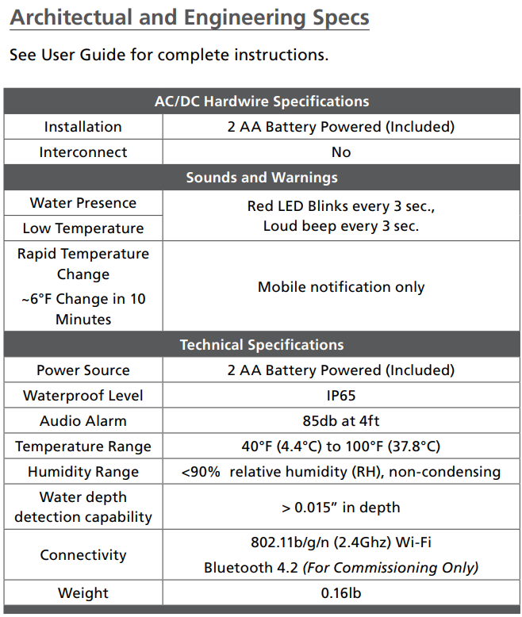
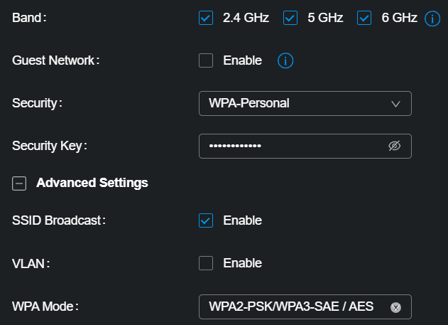
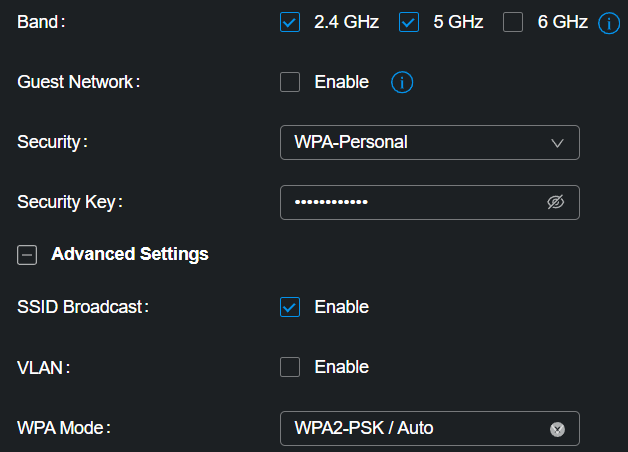
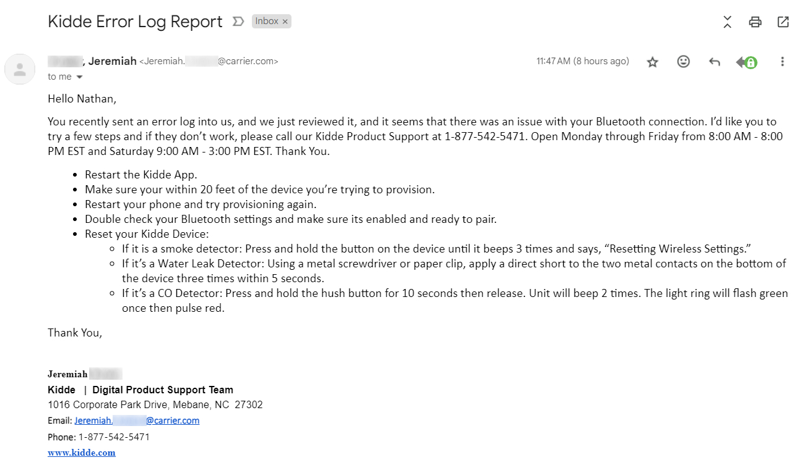

## Too Long Didn't Read

The Kidde Water Leak + Freeze Detector (60WLDR-W) does not support WPA3-SAE
authentication and/or WiFi 6 dual band networks.

## Background

Some recent storms in Iowa led to me taking shelter in my basement and discovering
an indoor pool was forming.



After dealing with the cleanup, I vowed to not get surprised again and went to
Menards to get a leak detector that ideally connected to WiFi so I could see
alerts if I was not home.

The only thing my local Menards had in stock was the
[Kidde Water Leak + Freeze Detector](https://www.kidde.com/home-safety/en/us/products/smart-home/smart-water-leak-freeze-detector/)
so I went with it, especially as it claims Google Home compatbility.

## Setup

In short, while my phone seemed to connect via Bluetooth to the device fine,
it just refused to connect to my WiFi. It would show loading for ~2 minutes before giving
up with no information as to why it failed.
The box and [manual](https://www.shareddocs.com/hvac/docs/2001/Public/02/product-detail-sheet-60WLDR-W.pdf)
prominently display that
2.4 GHz WiFi is required, but I didn't think anything of it, since all of
my Wyze devices and MyQ garage door opener only support 2.4 GHz and they work fine.

After doing some Googling and seeing
[this help article](https://help.kidde.com/hc/en/6-kidde/faq/801-how-can-i-ensure-my-wi-fi-network-is-on-a-compatible-2-4-ghz-band/)
I started to get suspicious. I use TP-Link Omada WiFi 6 access points and have
a dual band SSID with 2.4, 5, and 6 GHz bands. Apparently the WPA2-PSK/WPA3-SAE
authentication that Omada requires you to use with WiFi 6 is not supported by the
Kidde detector.

## Fix

I ended up creating a seperate SSID just for this one device in Omada and disabling
WiFi 6. Leaving 5 GHz enabled still worked fine, it just took issue with WiFi 6 and
the authentication required.

## Afterwards

I do want to give some props to Kidde. While trying to set up the device multiple times,
the app did allow me to send automated error reports. I submitted at least one of these
and actually got an email the following business day from a real employee
at Kidde saying they had recieved the report and suggested some troubleshooting steps.

I am incredibly surprised and impressed by this. I've never once had a company
contact me about any (automatic or manual) error reports I submit.
