## Background

After graduating college, I've moved into an apartment more permanently than 3-4 months
at a time in the past. Because of this, I finally built myself a small
[homelab](https://www.reddit.com/r/homelab/) in a proper server rack,
which I've been wanting to do for a long time. This is sort of a follow-up to
"[Building a Home Network on a Budget]()".

## Apartment Internet

For a little bit of background before we dive in,
my apartment's internet is a bit atypical. I don't have service directly through
my ISP. Instead, the internet is provided by my apartment complex through
[Spectrum Community Solutions](https://www.spectrum.com/communitysolutions/home).
Only WiFi is available, and I have to go into a web portal and manually add
the MAC address of every device I have to my account so that they can connect.
Even after doing this, many of my devices would still just refuse to connect:

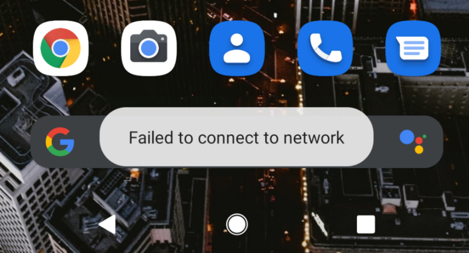

This was infuriating to say the least and I found the 5mbps guest WiFi more reliable.
The good news is, my apartment has a WiFi router in it, and it's plugged into the wall.

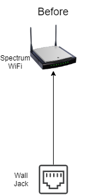

With a bit of experimentation, I discovered that just unplugging the Spectrum WiFi
access point, and plugging the wall jack directly into my laptop resulted in an
internet connection! No Spectrum authentication bullshit, and it was full gigabit
both ways (better than the 300mbps promised)! So as to not disturb the internet
for my neighbors, I put a switch between the wall jack and the Spectrum WiFi access
point so that I could connect my own devices via Ethernet. I did have to go out
and buy a PoE switch, as the existing access point was PoE and I didn't own a
PoE switch.

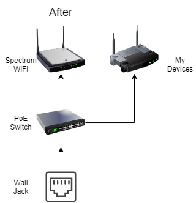

## Network Infrastructure

Here are the components of my home network infrastructure.

### TP-Link TL-SG1005P - $49.99

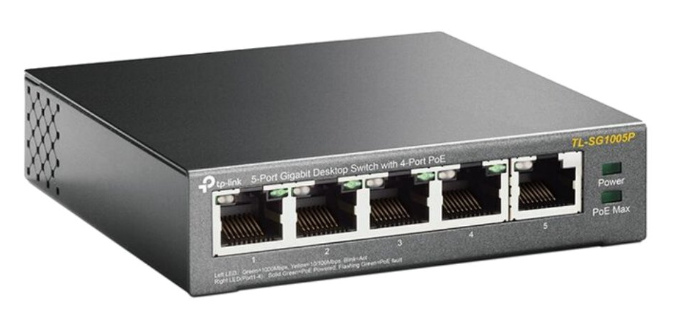

This was the little PoE switch I got to break out the ethernet from the wall.
It was the least expensive thing I could find at my local Microcenter.

### Qotom Q535G6 - $373.46

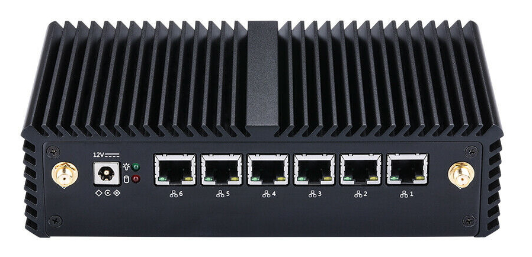

This is a fanless mini PC I got on [eBay](https://ebay.us/Q7sGUT), which I have
installed [pfSense](https://www.pfsense.org/) on and am using as my router.
I bought one with an Intel i3-7130U, 4GB of RAM, and 32GB mSATA SSD. I also sprang for
the $25 [rackmount case upgrade](https://ebay.us/clsesA).
When I was looking at these earlier,
the rackmount cases where near-impossible to get, and when I was actually ready to
buy, only the 6-port version of the rackmount case was available. Thus, I bought
the matching 6-port mini PC and rack case. Now, there's 4-port versions back in stock,
which would have saved me a lot of money on the PC, as I don't need all 6 ports. Oh well.

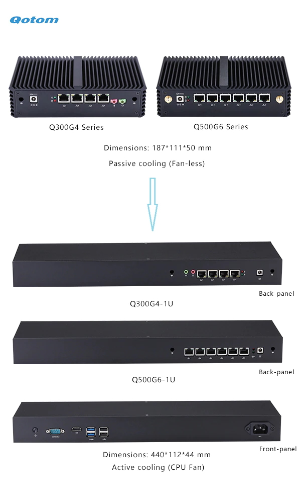

When the computer arrived (they were nice enough to assemble
it for me in the rack case), I plugged it in and was very surprised to learn it in-fact
had a fan. I didn't look closely at the diagram above to see "Active cooling".
However, the fan was making a horrible grinding sound, but only when the computer
was right-side up. I figured out the cause to this is that the fan is
installed on the bottom-side of the motherboard.
In a normal resting position, this means the little laptop cooling fan is upside down.
The bearing in the fan has enough slop in it that the fan rubs against its shell
and makes the grinding sound. Unfortunately, due to how the case is designed, you
have to take apart basically the entire thing to get at the bottom.

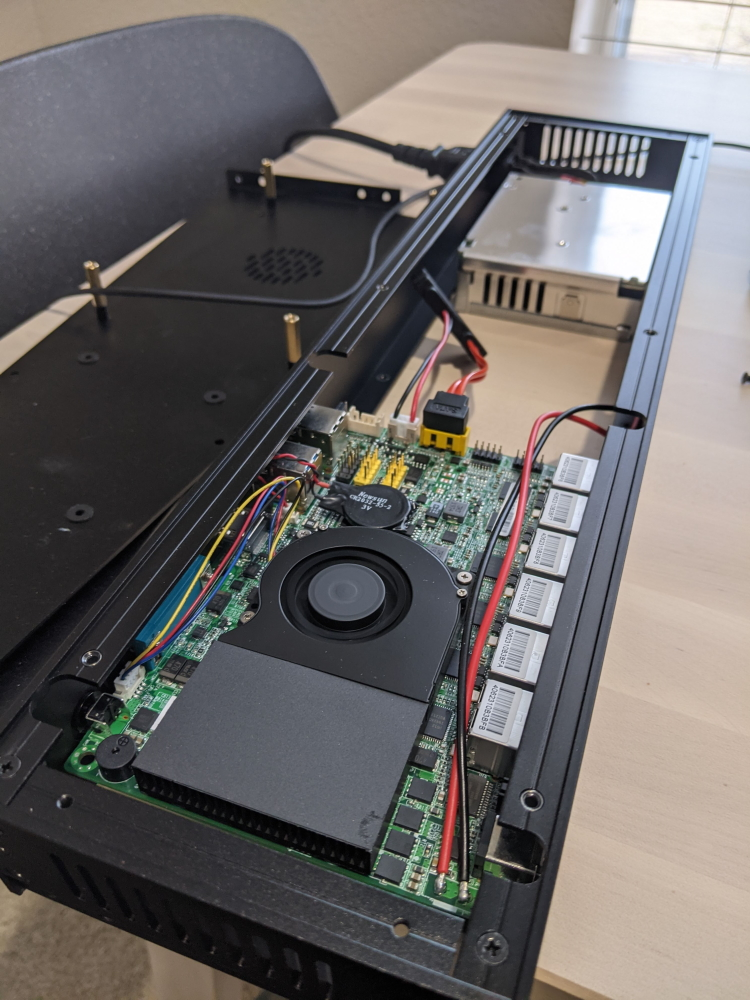

After figuring out how to take apart the whole thing, fixing it was relatively easy.
I loosened a few screws in the fan's shell and put a few pieces of cereal box cardboard
in the edge to shim the shell a bit. I taped it all in place, flipped it back
upside-down, and the fan stopped grinding.

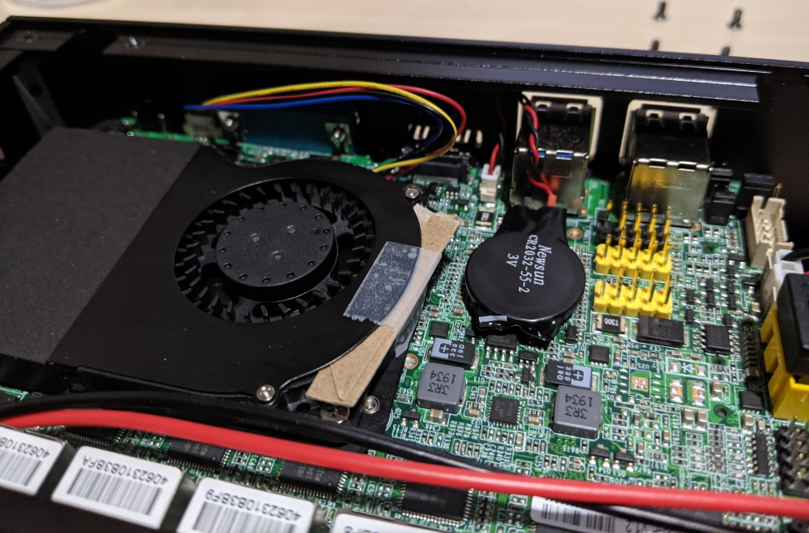

After all this, I installed pfSense on the computer. I've set
[pfBlockerNG](https://www.reddit.com/r/pfBlockerNG/) to replace
Pi-hole to do DNS filtering. I really like that I can
[redirect all DNS queries](https://pfsense-docs.readthedocs.io/en/latest/dns/redirecting-all-dns-requests-to-pfsense.html)
to my pfSense box, as this stops devices with hard-coded DNS servers from bypassing
the local DNS server.

I've configured port 1 as my WAN, port 2 as my LAN,
port 3 as my WLAN connected directly to my wireless access point, and port 6 as
my Work-from-home LAN. The only thing different about my Work-from-home LAN is that
I've disabled the DNS filtering and redirection rules on that so as to not interfere
with my corporate VPN or remote resources.

I love looking at pretty graphs, so I've really enjoyed looking at the data that
the [ntopng](https://www.ntop.org/products/traffic-analysis/ntop/)
package on pfSense provides.

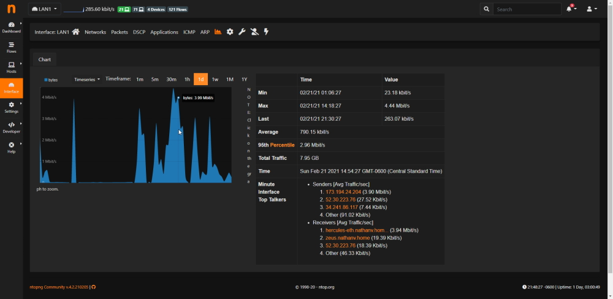

### TP-Link Archer C1900 - $34.99

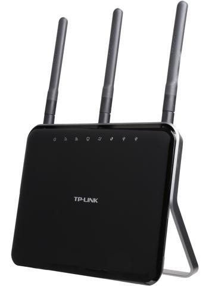

This is the same WiFi router from before. Instead now, I'm using it as an access point
rather than a router. This was pretty easily done by disabling the DHCP server
and plugging in the inbound connection to a LAN port rather than the WAN port.
I also went in and turned off all the security features and UPnP as this is
all handled by the firewall now.

There was one major issue though that I had to fix. As I put my wireless
clients on a different subnet than my wired clients, I was unable to access the
TP-Link web portal from a wired device. It turns out that by default,
in a setup like this, the device doesn't set a default gateway. I had to
access the web portal from a device on the wireless subnet and manually add a route.

### TP-Link TL-SG1024 - Free

I got this for free a few years ago. It's older and not grey like the newer
productions of this model. My switch is like the picture above and is a butt-ugly
vomit brown/green color. I did spend $14.95 on a
[Noctua NF-A4x20 FLX](https://www.amazon.com/dp/B072JK9GX6)
fan to replace the original 40mm fan to make it quieter.

")

### CyberPower OR500LCDRM1U - $164.95

To power everything, I purchased this 1U UPS for my networking equipment.
My desktop computer is already on a different UPS.
I specifically choose this one as it's shallower
than many other options. My rack is pretty shallow and some of the other 1U UPS's
available would only give an inch or two of clearance in the back, while
this is closer to 6.

It only supports up to 300W, but that works fine for me. Under a normal load, I'm only
using around 25% capacity (75W), and even with full CPU usage on my primary server,
the load then is around 50% (150W). Under normal conditions, this gives me nearly
30 minutes of runtime off the battery.

The UPS also comes with some pretty nifty web-based software called
[PowerPanel](https://www.cyberpowersystems.com/products/software/power-panel-business/)
that lets you see statuses, run tests, and setup alerts.

I created a Dockerfile for this software as I couldn't find a pre-made one that
was updated. See [powerpanel-business-docker](https://github.com/NathanVaughn/powerpanel-business-docker).

### 6U Rack - $50

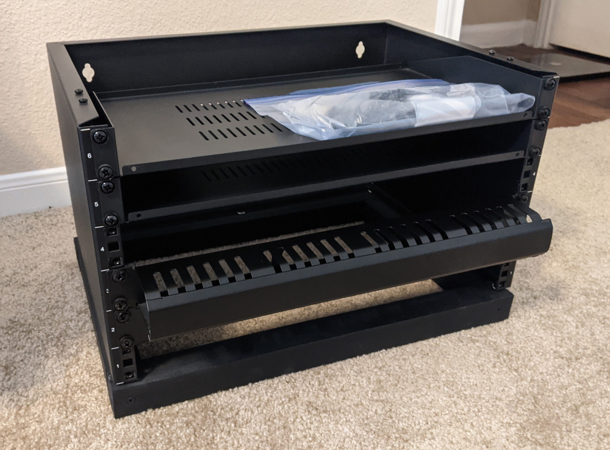

Last but not least is the rack itself. I was able to snag this on Craigslist for $50
with everything included. I'm not sure what brand the rack itself is,
but the shelves come from Navepoint. It included the two shelves, a blanking plate,
a cable routing blank, all the original hardware, and the previous owner made a nice
little wood base for it. It's all in spotless condition too. Not a single scratch.

It's a bit smaller than I wanted, as I was thinking of getting a 9U to be able
to put my server into a 3/4U rackmount case, but the price was too good to pass up.

## Diagram

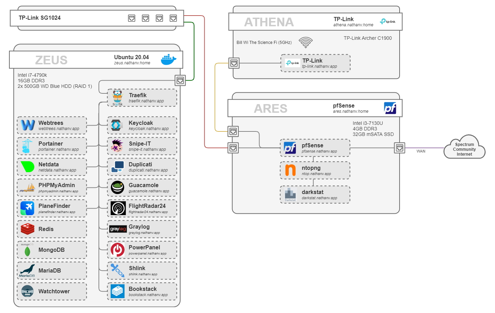

The "zeus" server is the [Sun Ultra 24]() server
from before, just with a fan upgrade to be quieter, and now two HDD's in RAID 1 via
software RAID in Ubuntu. Everything on it runs in a Docker container.

If you're wondering how all the web apps are accessed, here's a short explanation:

**Internally**: DNS is setup on my pfSense DNS resolver such that every subdomain of
`nathanv.app` resolves to my main server running Traefik.
This acts a reverse proxy to all web apps. Legitimate HTTPS certificates are obtained
via Let's Encrypt and DNS challenge.

**Externally**: Much like ["Self-Hosting with Docker and Argo Tunnel"](),
I'm using Cloudflare's Argo Tunnel on my main server, which is connected to Traefik.
All the subdomains on external DNS are CNAME'd to this tunnel. Cloudflare is then
serving their HTTPS certificate.

This is called a [Split-Brain DNS](https://en.wikipedia.org/wiki/Split-horizon_DNS)
setup.

For authentication, I replaced Cloudflare Access with
[Keycloak](https://www.keycloak.org/) and
[Traefik Forward Auth](https://github.com/thomseddon/traefik-forward-auth).
Most applications authenticate against Keycloak with either SAML or Open ID Connect
(OIDC) (basically OAuth2). The applications that don't inherently have authentication
(Netdata, etc.), or are sensitive and could use a second layer (PHPMyAdmin, etc.)
are protected with Traefik Forward Auth, which authenticates against Keycloak via OIDC.

## Conclusion

Quick summary:

- PoE Switch: Splitting apartment complex internet connection
- pfSense: Router, DHCP, DNS
- TP-Link Archer: WiFi AP
- Non-PoE Switch: LAN
- Sun Ultra 24: Primary server

In total, I've spent $688.34 on this project, before the small stuff
like Velcro straps and color-coded cables. Call it $750. I now realize that's
a lot of money. I am extremely pleased how it's turned out, though, and don't
foresee any changes for the near future. There is a large hole on the
second shelf, and that's intended to be room for a modem if/when I move
out of this apartment complex and have my own internet connection. Maybe
I'll find a use for my Raspberry Pi and put it there since it's been retired
from running Pi-hole.

It also looks pretty cool in the dark.

_Full Disclosure:_ **After** I originally posted this article, Traefik Labs
reached out to me and sent me a swag bag free of charge.

