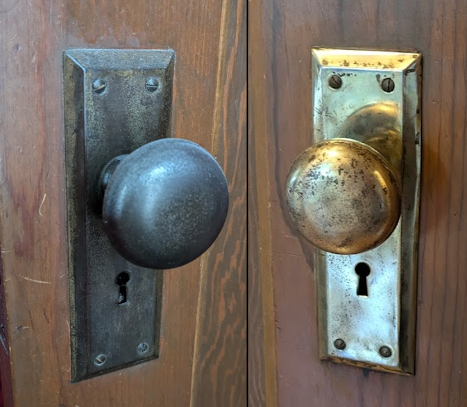

## Background

My house is currently 104 years old. I'm reasonably certain all of the doors and
door hardware are original. I've refinished many of the doors, but the hardware
is not looking that great. Here is how I managed to polish most of the brass
door hardware to look _better_. This is not going to be some magic bullet.
If the brass has been worn off, there is no way to get it back without re-plating it
which is not a simple process. But I feel I had a method that spent 20% of the effort
and got 80% of the results for my old Mortise sets.

## Supplies

- Brasso (can order online or get at most hardware stores)
- Microfiber cloths
- A lot of vinegar (I used over a gallon)
- Sacrificial pot (grab one from a thrift store, you won't want to reuse it for food again)
- Bench grinder ([One I bought at Menards](https://www.menards.com/main/tools/power-tools/grinders/tool-shop-reg-2-1-amp-corded-6-bench-grinder/2411407/p-1444448120364-c-9075.htm))
- Polishing wheels ([Amazon link](https://www.amazon.com/dp/B0BM6YWTS1/))
- Tongs
- Gloves
- Safety glasses
- Face mask

## Process

First, remove the hardware from the door. You'll need to remove the door knob first,
there should be a screw on each side holding the knobs together. After removing that,
you can remove the knob, and then slide out the other side. Next, remove the screws
holding the faceplates on each side. These may be stuck on the door even after
removing the screws, so thwack it with your screwdriver handle a few times to get
it to come off.

Next, put some vinegar in a pot and bring it to a boil. Once it's boiling,
put the hardware in the pot with the tongs. Let it sit for two to three minutes
before taking it out. Be sure to empty the doorknobs of any liquid vinegar that
may be inside. Getting burned with boiling hot vinegar later is not a fun surprise.

I found this tip online, and it does seem to help get the
initial layers of gunk off. I recommend wearing safety glasses and a mask for this process,
the boiling vinegar will smell _terrible_ and hurt your eyes, like chopping an onion.
After doing this, the hardware will have a matte copper color to it.



Next, start using the bench grinder with the polishing wheels. I found the orange
wheel with a little bit of the green compound worked best. Don't use too much of the
compound as you'll have to wipe it off. I found two dabs of compound on the wheel
was usually sufficient for each faceplate. Work slow and methodically,
it's easy to wear through the brass plating. I highly recommend wearing gloves and
safety glasses for this, you're putting a lot of energy into the hardware and it will
heat up significantly. Normally you shouldn't use gloves with rotary tools, but the
wheels are soft and it's hard to hurt yourself with them. Hold on tight to the knobs,
it's easy to let them get away from you and go flying.

I found that roughly it would take me about 10 minutes to do each faceplate, and a few
minutes per knob, so budget time accordingly. It may take longer depending on how much
of a perfectionist you are.

Hand polish some of the hard-to-reach areas with the Brasso and a microfiber cloth,
and wipe off the compound. When you're done, put the hardware back on the door in
reverse. Be sure not to cross thread the door knob screws, I found that easy to do.
Flip which side the faceplates and knobs are on to taste.

Like I said, this is not a magic bullet. While the above set of hardware came out
really well, the below set had more mixed results.

## Conclusion

While not perfect, I think it looks better than it did, and it was far cheaper
than buying
[replacement hardware](https://www.houseofantiquehardware.com/antique-door-lockset-new-york-round),
even
[cheap stuff](https://www.homedepot.com/p/Defiant-Brass-Metal-Satin-Brass-Knob-Mortise-Set-805414/321519375)
when multiplied by the two dozen doors in my house.

If you're more adventurous, you could potentially try DIY re-plating hardware as
[this video](https://youtu.be/PhFDJUS7Ddw) shows, but it does seem it may take away
some of the mirror finish that this retained.
