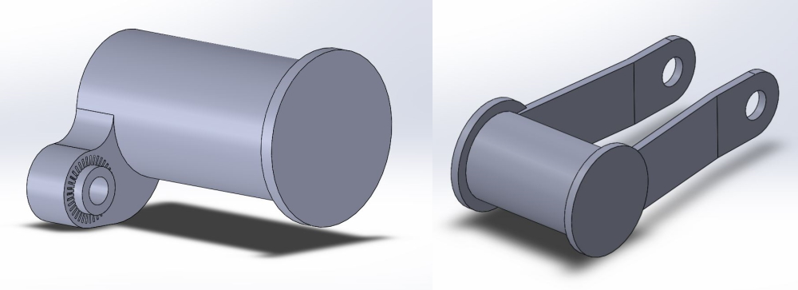
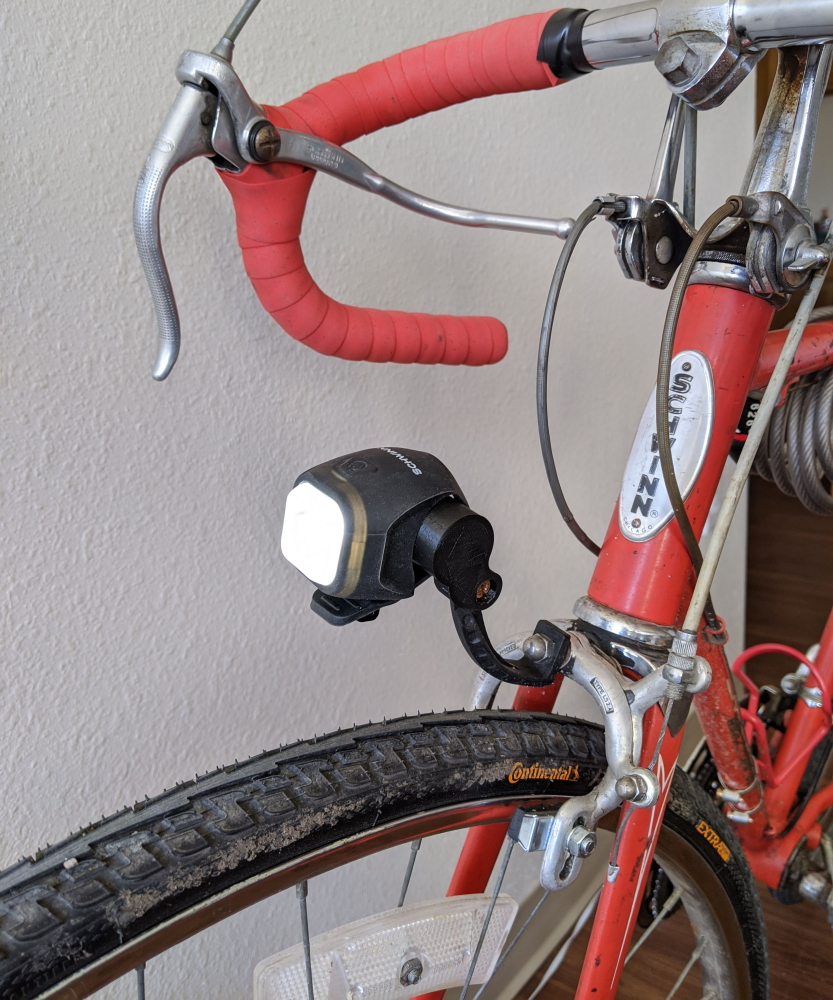
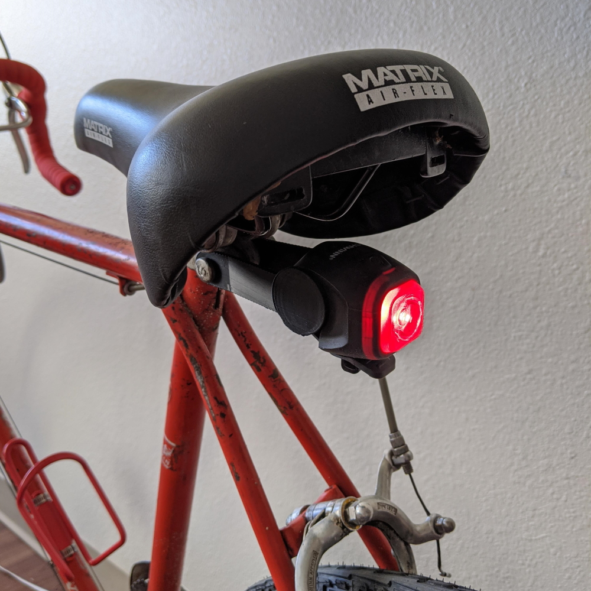
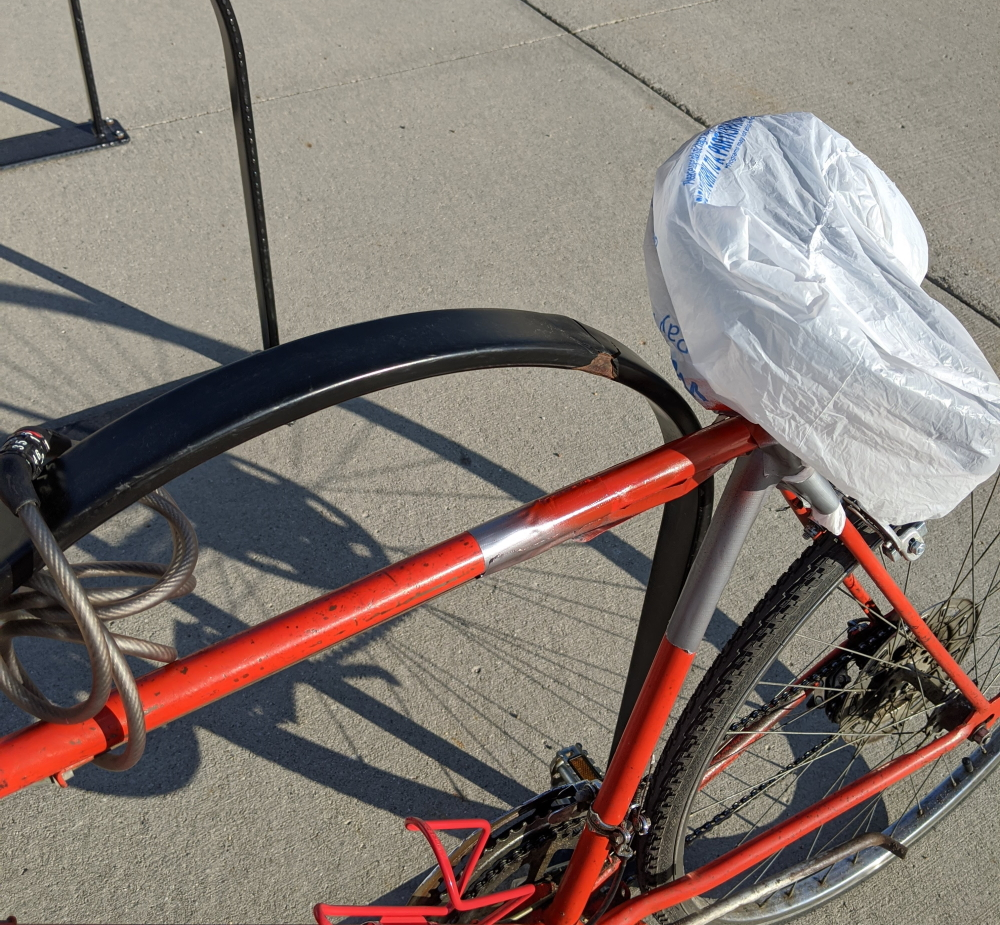
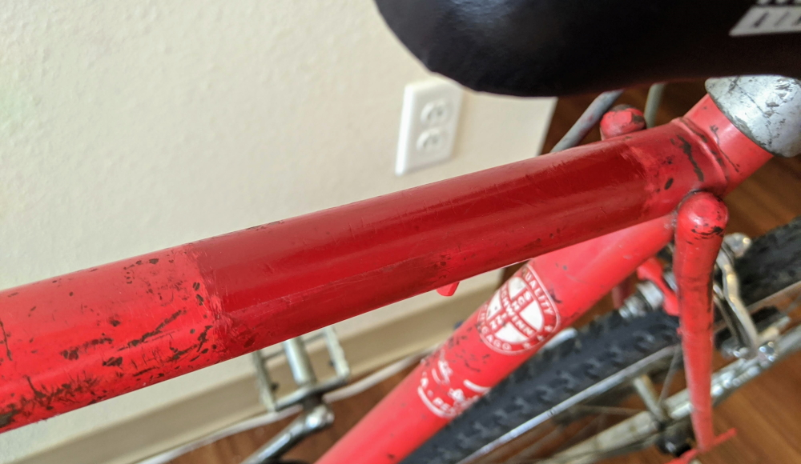

## Background

I just wanted to give a small update on my
[1973 Schwinn Varsity]()
that I've been working on.

## Light Mounts

As mentioned in the previous post, I got some little silicon wrap-on lights
for the bike at night. However, there's not many convenient places to put them on the
bike, especially in the rear. To fix this, I designed some new mounts to replace
the current reflectors.

After convincing a friend to 3D print them for me, I got them installed with no
problems. They fit perfectly as designed.

It all works great, and they don't vibrate much in motion. The only thing is that
the rear mount needs to be printed with 100% infill, as the bolt on the seat post
applies a lot of compressive pressure to the part when tightened.

## Painting Over Phone Number

Also as mentioned in the previous post, I wanted to paint over the phone number
scratched into the frame. For this, I got basic 80 grit sandpaper and a can of
red glossy Krylon spray paint. I took the bike outside and sanded off the existing
paint along with as much of the phone number etched in as I could. I couldn't get
the seat off for the life of me, so I ended up just turning the seat 90 degrees
out of the way and putting a plastic bag over it. I was also nearly out of painter's
tape, so I used cheap duct tape as a mask. I put a quick coat of paint on
then chained the bike to the nearest bike rack and let it dry.

I put one more coat of paint on before removing all the masking. Overall, it came out
well, however the bike is more orange than I had thought when at Lowe's buying red
spray paint. It doesn't match well in color or in quality as the rest of the bike's
paint is much rougher and more orange-y.

You can see above that I tried to sand the edge of the new paint a tad so it blended
marginally better than a solid line of a different color.

## Conclusion

I'm really happy, and plan on riding this until the wheels fall off,
because damn are new bikes expensive.
Yes, the bike is old, tired, and ugly. But damnit, I fixed it myself, I learned a lot,
it rides pretty well now, and was the best price, free.
