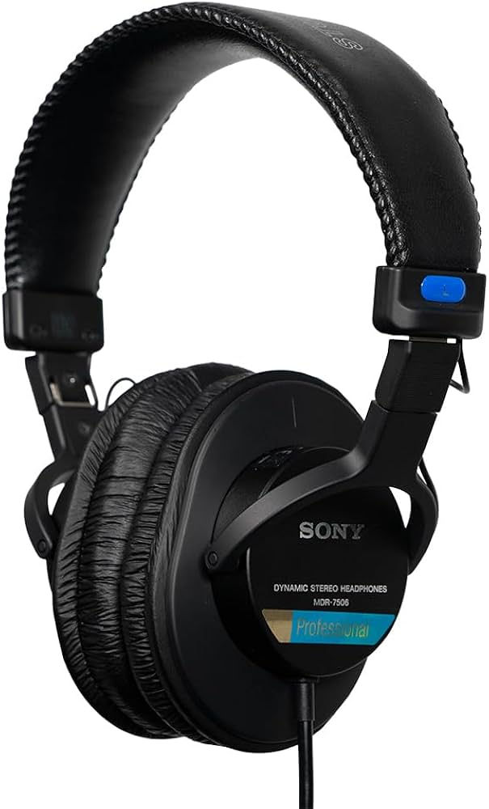
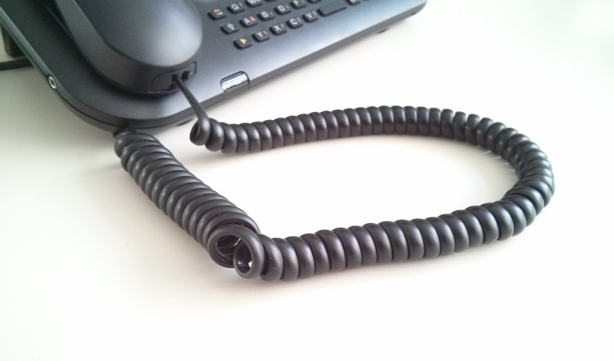
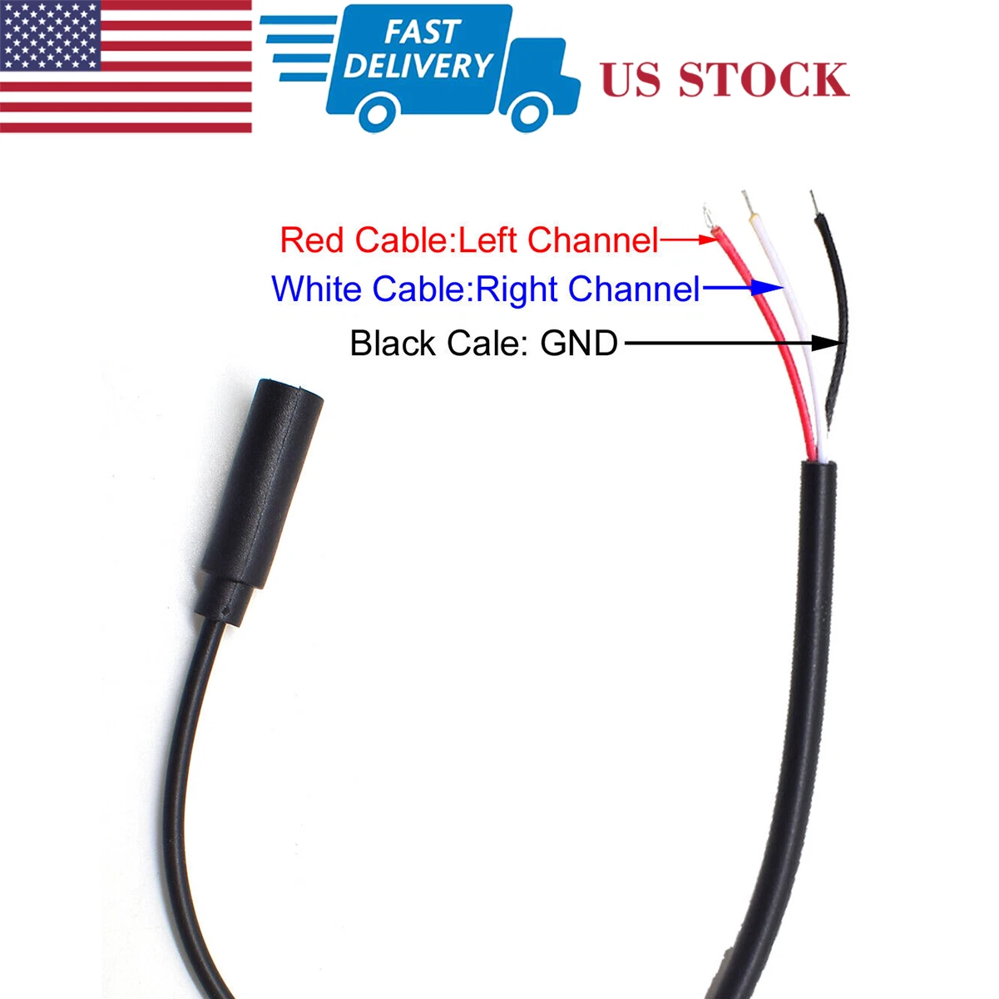
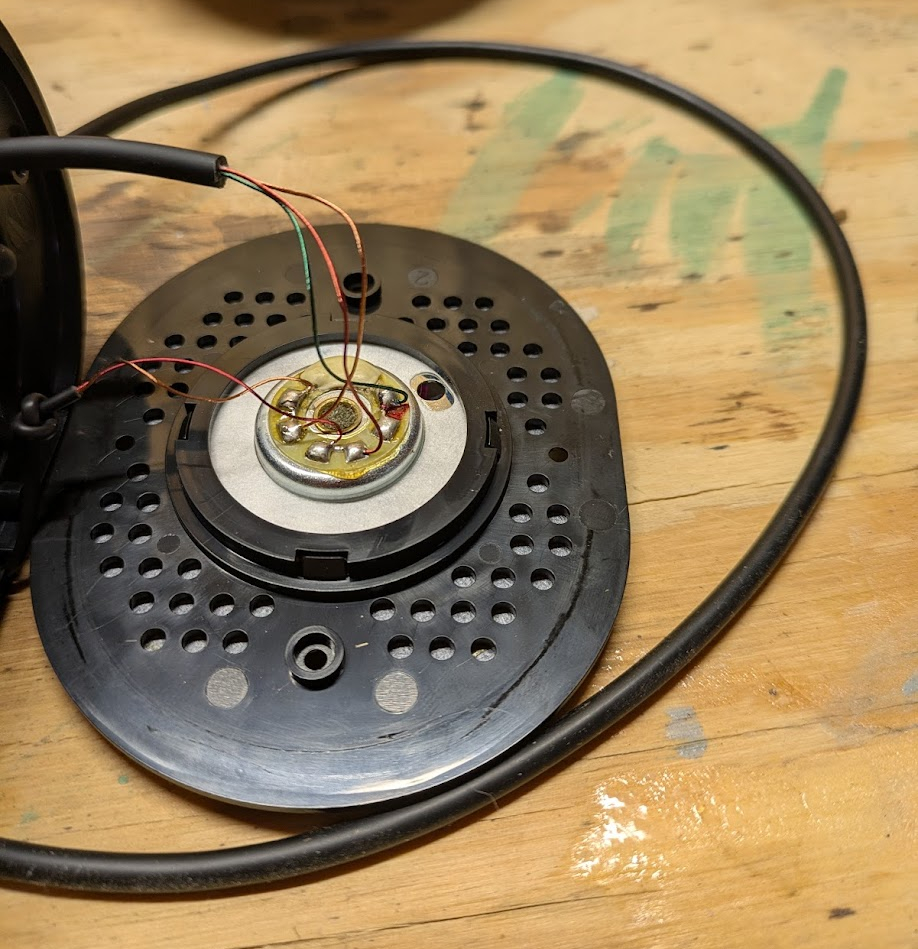
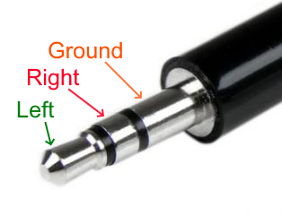
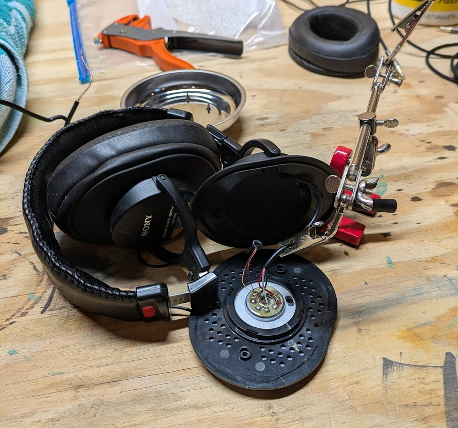
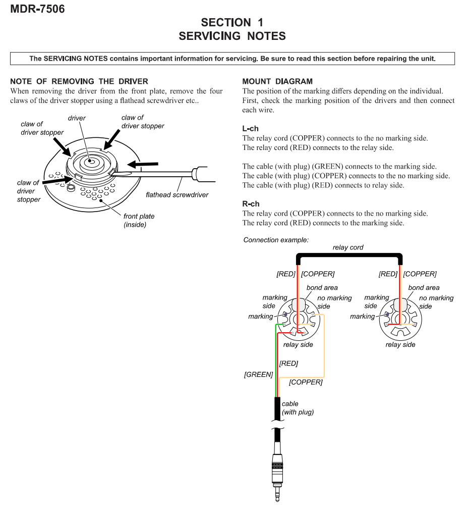

## Background

The Sony MDR7506 headphones. They're the quintessential studio headphones.

I absolutely adore my pair, however for the life of me,
I cannot stand the coiled cable. It always gets tangled up on itself,
and drives me bonkers.

## Modification

Not wanting to pay [$41, before shipping](https://www.trewaudio.com/product/remote-audio-7506sc/),
I finally took matters into my own hands and modified my pair to have a
detachable cable. Now, I can use any cable I want with my favorite headphones.

While adding a flush mount 3.5mm female port would have been nice, I felt getting
that installed cleanly was going to be a challenge, so I went down an easier
route of instead having a small dongle stick out instead.

Total cost: $22.32

- $9.33: Female stereo jack to bare wire. There are lots of these available for cheap on eBay.
- $12.99: 10 ft braided 3.5mm cable.

The modification is very simple and only takes around 20 minutes.

1. Remove the earpad on the left side
2. Remove the 4 screws that hold the front plate on
3. Carefully remove the front plate

4. Carefully desolder the wires going to the main cable. The wiring is as follows:
   - Copper: Ground
   - Red: Right
   - Green: Left

5. After cutting to length, feed in the wires for the new jack.
   Make sure to add a loop around the posts inside the ear cup.
6. Solder the wires on to the old solder pads. Make sure to match the
   colors up correctly. The service manual has a good diagram.

7. Put it all back together!

## Conclusion

I love it. The mod came out great, and the headphones still work perfectly.
The short dongle doesn't bother me at all, which I was afraid of.
