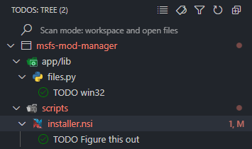
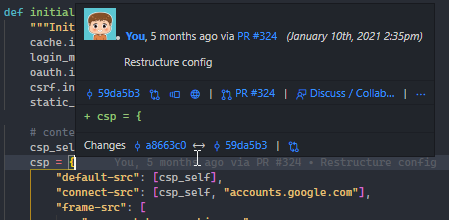
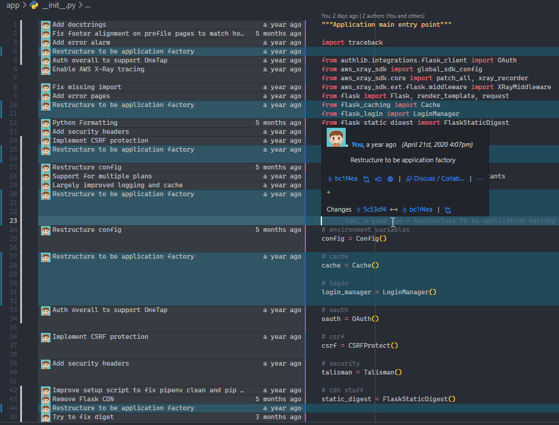
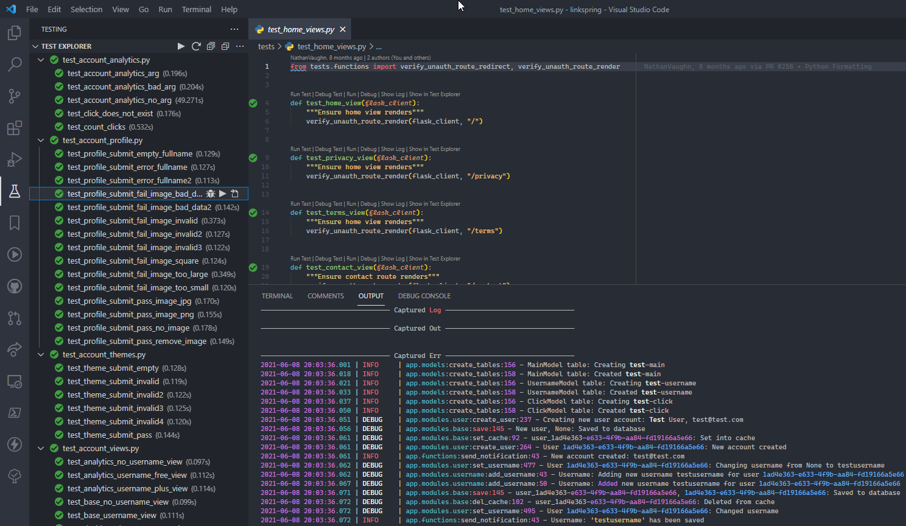
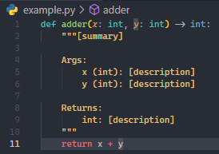
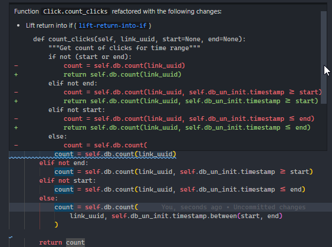
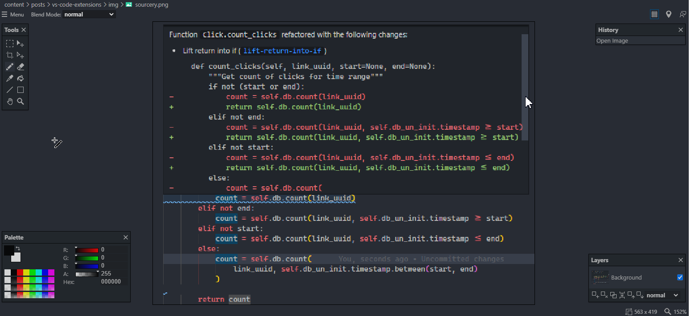
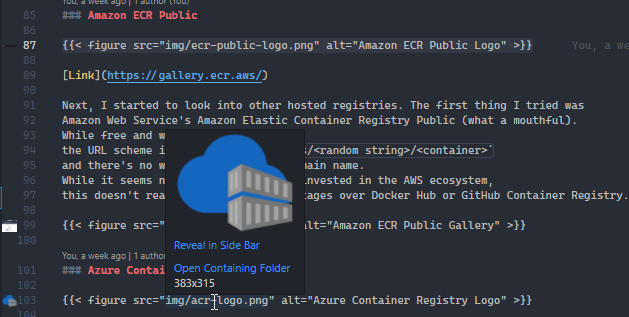
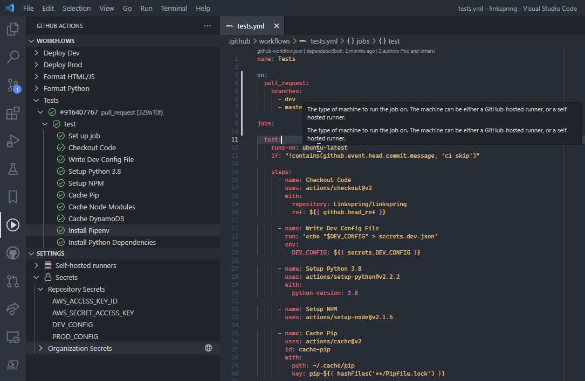

Here are some of my favorite VS Code extensions and settings that are a bit
lesser-known, or have been game changers for my development workflow.

## General

### Bracket Colorizer

[https://marketplace.visualstudio.com/items?itemName=CoenraadS.bracket-pair-colorizer-2](https://marketplace.visualstudio.com/items?itemName=CoenraadS.bracket-pair-colorizer-2)

Do you ever have a gnarly mess of nested parantheses or curly braces because of some
math expression or JSON? Well fear not anymore, this extension color-codes
brackets with rainbow colors to indicate which parentheses belong to each other.


### TODO Tree

[https://marketplace.visualstudio.com/items?itemName=Gruntfuggly.todo-tree](https://marketplace.visualstudio.com/items?itemName=Gruntfuggly.todo-tree)

This extension helps find all of your `TODO`s and `fixme`s in your code and displays
them in a helpful tree view.



### Live Share

[https://marketplace.visualstudio.com/items?itemName=MS-vsliveshare.vsliveshare](https://marketplace.visualstudio.com/items?itemName=MS-vsliveshare.vsliveshare)

It's like Google Docs but for code. You can even share terminals and local servers.
If you haven't heard of this already, what are you doing? Sooooo useful at work
when a coworker or myself needs a second set of eyes to help debug an issue.

### Thunder Client

[https://marketplace.visualstudio.com/items?itemName=rangav.vscode-thunder-client](https://marketplace.visualstudio.com/items?itemName=rangav.vscode-thunder-client)

It's like Postman, but built in to VS Code. It can even import and (sort of) export
Postman files.


## Git

### Git Graph

[https://marketplace.visualstudio.com/items?itemName=mhutchie.git-graph](https://marketplace.visualstudio.com/items?itemName=mhutchie.git-graph)

Git Graph is probably my absolute favorite extension. Git Graph is basically
a GUI Git client right in VS Code. Coupled with VS Code's existing Git integration,
it turns VS Code into a formidable Git GUI.


I mostly use it for branching and merging. And frankly, I almost never even
use a Git GUI client like [GitKraken](https://www.gitkraken.com/)
anymore (except for a few rare edge cases) as this has everything I need.

### GitLens

[https://marketplace.visualstudio.com/items?itemName=eamodio.gitlens](https://marketplace.visualstudio.com/items?itemName=eamodio.gitlens)

GitLens adds a ton in-line Git blame information
(among other functionality).



This is fantastic when working with other developers to easily identify who
last edited a line and can subsequently be yelled at for breaking the tests 😛.



## Python

Besides Microsoft's
[Python VS Code extension](https://marketplace.visualstudio.com/items?itemName=ms-python.python),
here are my favorite Python extensions.

### Python Test Explorer

[https://marketplace.visualstudio.com/items?itemName=LittleFoxTeam.vscode-python-test-adapter](https://marketplace.visualstudio.com/items?itemName=LittleFoxTeam.vscode-python-test-adapter)

The Python Test Explorer extension adds really handy UI on the side to see
all of your tests, and quickly run, debug, and view tests.



Make sure to go into your settings and enable detection for your testing framework.
For example:

```json
"python.testing.pytestEnabled": true,
```

### Python Type Hint

[https://marketplace.visualstudio.com/items?itemName=njqdev.vscode-python-typehint](https://marketplace.visualstudio.com/items?itemName=njqdev.vscode-python-typehint)

With my recent love of [Python's type hinting](https://www.python.org/dev/peps/pep-0484/)
this extension helps remind you and autocomplete type hints as you type
a function definition.


In addition to this, enable PyLance warnings for type issues:

```json
"python.analysis.typeCheckingMode": "basic",
```

I am not joking when I say this one setting completely changed the way I write Python
code. Having warnings of possible type issues in my code before I ever run it
has completely revolutionzied my development workflow. It has saved so much of
my time showing issues I would not have found until much later. I now
get irrationally angry when things like
[Protobufs](https://github.com/protocolbuffers/protobuf/issues/2638#issue-203602478)
don't have proper type hints.


### Python Docstring Generator

[https://marketplace.visualstudio.com/items?itemName=njpwerner.autodocstring](https://marketplace.visualstudio.com/items?itemName=njpwerner.autodocstring)

This extension helps pre-fill out Python docstrings for functions. I like it a lot
to help keep my docstring style consistent. It comes with a few different presets
depending on what you like.




### Sourcery

[https://marketplace.visualstudio.com/items?itemName=sourcery.sourcery](https://marketplace.visualstudio.com/items?itemName=sourcery.sourcery)

Holy crap, this one is a game changer. This extension automatically suggests intelligent
refactorings for your code. It is truly magical, and difficult to describe how
amazing it is.



It even adds a "quick fix" button too so you can one-click accept the suggestions.

I am not sponsored by Sourcery in any way, I just really like their product.

## Markdown

### Luna Paint

[https://marketplace.visualstudio.com/items?itemName=Tyriar.luna-paint](https://marketplace.visualstudio.com/items?itemName=Tyriar.luna-paint)

This is a fairly well featured image editor inside of VS Code. I find this insanely
useful while writing Markdown as I can paste a screenshot into it, crop it, resize it,
draw boxes on it, then save it, without needing to open another program.



### Image Preview

[https://marketplace.visualstudio.com/items?itemName=kisstkondoros.vscode-gutter-preview](https://marketplace.visualstudio.com/items?itemName=kisstkondoros.vscode-gutter-preview)

Have you ever wanted to be able to hover over a file path of an image,
and have it displayed in VS Code? Well, that's exactly what this extension does.



Besides Markdown this also really helpful for writing CSS or HTML templates with icons.

## CI/CD

### Azure Pipelines

[https://marketplace.visualstudio.com/items?itemName=ms-azure-devops.azure-pipelines](https://marketplace.visualstudio.com/items?itemName=ms-azure-devops.azure-pipelines)

While I don't use Azure Pipelines in my personal projects, I do use them extensively
at work. This extensions helps a ton by providing completion for tasks
and showing syntax errors.


I'd also recommend setting up your file associations with a bit more generic matching
patterns. For example, I often have multiple Pipeline files like
`azure-pipelines-test.yml` and `azure-pipelines-package.yml` or
[template files](https://docs.microsoft.com/en-us/azure/devops/pipelines/process/templates?view=azure-devops#insert-a-template)
such as `python-pytest-steps.yml`.

```json
  "files.associations": {
      "azure-pipelines*.yml": "azure-pipelines",
      "*-steps.yml": "azure-pipelines",
  },
```

### Github Actions

[https://marketplace.visualstudio.com/items?itemName=cschleiden.vscode-github-actions](https://marketplace.visualstudio.com/items?itemName=cschleiden.vscode-github-actions)

This extension is very similar to the Azure Pipelines extension as it helps
you complete the schema for Github Actions. The really cool thing about this
one however is that it also allows you to manage your Actions right in VS Code.
You can see logs of past runs, fire off new runs
(if you have `workflow_dispatch:` setup), and configure secrets.


